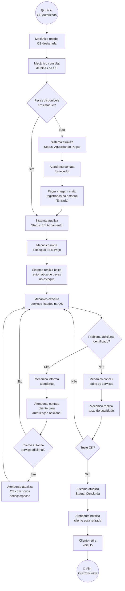
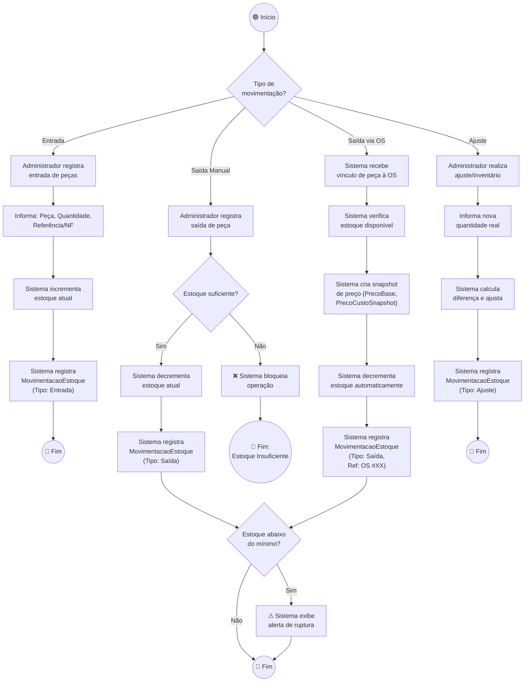
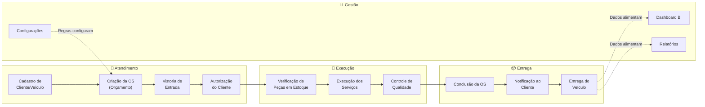

```mermaid
flowchart TD
    START(("🟢 Início")) --> A["Cliente chega<br/>à oficina"]
    A --> B{"Cliente já<br/>cadastrado?"}
    
    B -->|Não| C["Atendente cadastra<br/>Cliente (Nome, CPF,<br/>Telefone, Email)"]
    C --> D["Atendente cadastra<br/>Veículo (Placa, Marca,<br/>Modelo, Ano, KM)"]
    D --> E["Atendente coleta<br/>relato do problema"]
    
    B -->|Sim| B2{"Veículo já<br/>cadastrado?"}
    B2 -->|Não| D
    B2 -->|Sim| E
    
    E --> F["Atendente cria<br/>Ordem de Serviço<br/>(Status: Orçamento)"]
    F --> G{"Vistoria de entrada<br/>obrigatória?"}
    
    G -->|Sim| H["Atendente realiza<br/>Vistoria de Entrada"]
    H --> H1["Registra nível de<br/>combustível e KM"]
    H1 --> H2["Preenche checklist<br/>(estepe, macaco,<br/>triângulo, rádio,<br/>chave de roda)"]
    H2 --> H3["Mapeia avarias<br/>existentes no veículo"]
    H3 --> I["Sistema salva<br/>Vistoria vinculada à OS"]
    
    G -->|Não| J["Atendente seleciona<br/>serviços do catálogo"]
    I --> J
    
    J --> K["Sistema calcula<br/>valor de mão de obra"]
    K --> L{"Peças necessárias?"}
    
    L -->|Sim| M["Atendente vincula<br/>peças à OS"]
    M --> N["Sistema calcula<br/>valor total<br/>(MO + Peças)"]
    
    L -->|Não| N2["Sistema calcula<br/>valor total<br/>(apenas MO)"]
    
    N --> O["Sistema gera<br/>Orçamento com validade"]
    N2 --> O
    
    O --> P["Atendente apresenta<br/>orçamento ao cliente"]
    P --> Q{"Cliente autoriza<br/>o serviço?"}
    
    Q -->|Sim| R["Atendente registra<br/>autorização<br/>(Nome, Meio, Data)"]
    R --> S["Sistema atualiza<br/>Status: Em Andamento"]
    S --> END1(("🔴 Fim:<br/>OS Autorizada"))
    
    Q -->|Não| T{"Cliente deseja<br/>cancelar?"}
    T -->|Sim| U["Sistema atualiza<br/>Status: Cancelada"]
    U --> END2(("🔴 Fim:<br/>OS Cancelada"))
    T -->|Não| V["OS permanece como<br/>Orçamento aguardando<br/>resposta"]
    V --> END3(("🔴 Fim:<br/>Aguardando"))
```

# BPMN — Modelagem de Processos de Negócio — MechSystem

**Projeto**: MechSystem — Sistema de Gestão para Oficinas Mecânicas  
**Versão**: 1.0  
**Data**: Maio/2026  
**Autor**: Ryan Cristian  
**Disciplina**: Engenharia de Software III — Prof. Alessandro Fukuta

---

## 1. Objetivo

Modelar os **processos de negócio principais** do MechSystem utilizando a notação **BPMN (Business Process Model and Notation)**, representando os fluxos de trabalho entre os atores do sistema, desde o atendimento inicial até a entrega do veículo.

---

## 2. Processos Modelados

| # | Processo | Complexidade | Atores Envolvidos |
|---|---------|-------------|-------------------|
| 1 | Atendimento e Criação de OS | Alta | Cliente, Atendente, Sistema |
| 2 | Execução da Ordem de Serviço | Alta | Mecânico, Atendente, Sistema, Estoque |
| 3 | Gestão de Estoque | Média | Administrador, Sistema |
| 4 | Processo Completo (Ponta a Ponta) | Alta | Todos |

---

## 3. Processo 1 — Atendimento e Criação de Ordem de Serviço

### Descrição
Fluxo que inicia com a chegada do cliente à oficina e termina com a OS criada no sistema, incluindo orçamento, vistoria obrigatória e autorização do cliente.

### Diagrama BPMN

### Regras de Negócio Envolvidas

| Regra | Descrição |
|-------|----------|
| RN01 | A vistoria de entrada pode ser configurada como obrigatória nas Configurações do sistema |
| RN02 | O orçamento tem validade configurável (padrão: 10 dias) |
| RN03 | A autorização exige registro de responsável, meio e data |
| RN04 | O valor total da OS = Mão de Obra + Valor Efetivo de Peças |

---

## 4. Processo 2 — Execução da Ordem de Serviço

### Descrição
Fluxo que cobre a execução dos serviços aprovados, desde a alocação do mecânico até a conclusão e entrega do veículo.

### Diagrama BPMN

### Regras de Negócio Envolvidas

| Regra | Descrição |
|-------|----------|
| RN05 | A baixa de estoque é automática quando peças são vinculadas à OS |
| RN06 | Peças com estoque abaixo do mínimo geram alerta no sistema |
| RN07 | Serviços adicionais identificados durante execução requerem nova autorização |
| RN08 | Toda comunicação com cliente é registrada no sistema (ContatoOS) |

---

## 5. Processo 3 — Gestão de Estoque

### Descrição
Fluxo de gestão do inventário de peças, cobrindo entrada, saída e ajuste de estoque.

### Diagrama BPMN

### Regras de Negócio Envolvidas

| Regra | Descrição |
|-------|----------|
| RN09 | Toda movimentação registra: tipo, quantidade, data/hora, referência e usuário responsável |
| RN10 | Saída via OS cria snapshot imutável do preço (PrecoCusto e PrecoVenda no momento) |
| RN11 | Desconto abaixo do PrecoBase requer perfil Administrador |
| RN12 | Peça com estoque ≤ EstoqueMinimo é sinalizada como "Abaixo do Mínimo" |

---

## 6. Processo 4 — Visão Ponta a Ponta (End-to-End)

### Diagrama BPMN Macro

---

## 7. Legenda BPMN

| Símbolo | Significado |
|---------|------------|
| 🟢 Círculo verde | Evento de início |
| 🔴 Círculo vermelho | Evento de fim |
| Retângulo | Atividade / Tarefa |
| Losango | Gateway de decisão (exclusivo) |
| Retângulo tracejado | Sub-processo / Pool |
| Seta sólida | Fluxo de sequência |
| Seta tracejada | Fluxo de dados / mensagem |

---

## 8. Conclusão

Os diagramas BPMN demonstram que o MechSystem cobre **todo o fluxo operacional** de uma oficina mecânica, desde o primeiro contato com o cliente até a entrega do veículo. Os processos são interconectados e alimentam automaticamente os módulos de gestão (Dashboard, Relatórios), criando um ciclo virtuoso de dados para tomada de decisão.

---

*Documento elaborado como artefato da disciplina de Engenharia de Software III — FATEC 2026/1*
