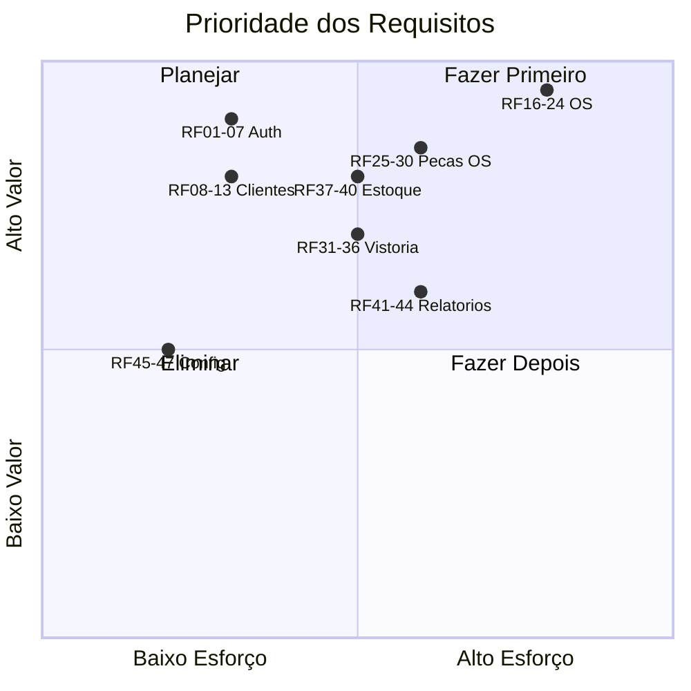

# Documentação de Requisitos — MechSystem

**Projeto**: MechSystem — Sistema de Gestão para Oficinas Mecânicas  
**Versão**: 1.0  
**Data**: Maio/2026  
**Autor**: Ryan Cristian  
**Disciplina**: Engenharia de Software III — Prof. Alessandro Fukuta

---

## 1. Introdução

Este documento especifica os **Requisitos Funcionais (RF)**, **Requisitos Não Funcionais (RNF)** e **Regras de Negócio (RN)** do sistema MechSystem, extraídos a partir da elicitação com stakeholders e da análise do código-fonte implementado.

---

## 2. Requisitos Funcionais (RF)

### 2.1 Módulo de Autenticação e Autorização

| ID | Requisito | Prioridade | Status |
|----|----------|-----------|--------|
| RF01 | O sistema deve permitir login com usuário e senha | Alta | ✅ Implementado |
| RF02 | O sistema deve criptografar senhas com BCrypt | Alta | ✅ Implementado |
| RF03 | O sistema deve manter sessão via Cookie com expiração de 8h e sliding expiration | Alta | ✅ Implementado |
| RF04 | O sistema deve suportar 3 perfis de acesso: Administrador, Atendimento e Mecânico | Alta | ✅ Implementado |
| RF05 | O sistema deve redirecionar usuários não autenticados para a tela de login | Alta | ✅ Implementado |
| RF06 | O sistema deve permitir criação de usuário administrador padrão no primeiro acesso (admin/admin123) | Média | ✅ Implementado |
| RF07 | O sistema deve permitir reset de senha do admin via flag de linha de comando (`--reset-admin`) | Baixa | ✅ Implementado |

### 2.2 Módulo de Gestão de Clientes

| ID | Requisito | Prioridade | Status |
|----|----------|-----------|--------|
| RF08 | O sistema deve permitir cadastro de clientes com Nome (obrigatório, máx. 100 chars), CPF (obrigatório, máx. 14 chars), E-mail, Telefone e Endereço | Alta | ✅ Implementado |
| RF09 | O sistema deve permitir consulta, edição e exclusão de clientes | Alta | ✅ Implementado |
| RF10 | O sistema deve vincular veículos a clientes (1:N) | Alta | ✅ Implementado |

### 2.3 Módulo de Gestão de Veículos

| ID | Requisito | Prioridade | Status |
|----|----------|-----------|--------|
| RF11 | O sistema deve permitir cadastro de veículos com Placa (obrigatória, máx. 10 chars), Marca, Modelo, Cor, Ano e Quilometragem | Alta | ✅ Implementado |
| RF12 | O sistema deve vincular cada veículo a um cliente (FK obrigatória) | Alta | ✅ Implementado |
| RF13 | O sistema deve permitir consulta, edição e exclusão de veículos | Alta | ✅ Implementado |

### 2.4 Módulo de Catálogo de Serviços

| ID | Requisito | Prioridade | Status |
|----|----------|-----------|--------|
| RF14 | O sistema deve permitir cadastro de serviços com Nome (obrigatório, máx. 100 chars), Descrição (máx. 500 chars), Valor Padrão (obrigatório) e Tempo Estimado em minutos | Média | ✅ Implementado |
| RF15 | O sistema deve permitir consulta, edição e exclusão de serviços | Média | ✅ Implementado |

### 2.5 Módulo de Ordens de Serviço

| ID | Requisito | Prioridade | Status |
|----|----------|-----------|--------|
| RF16 | O sistema deve permitir criação de OS vinculada a um veículo | Alta | ✅ Implementado |
| RF17 | O sistema deve registrar: Data de Emissão (automática), Previsão de Início, Previsão de Entrega (obrigatória/CDC) | Alta | ✅ Implementado |
| RF18 | O sistema deve calcular Valor Total = (Mão de Obra Efetiva + Valor Efetivo de Peças) - Desconto | Alta | ✅ Implementado |
| RF19 | O sistema deve implementar a regra de graceful degradation: se houver itens (peças/serviços) vinculados, usar soma calculada; senão, usar valor manual | Alta | ✅ Implementado |
| RF20 | O sistema deve gerenciar o ciclo de vida da OS com 5 estados: Orçamento(0), Aguardando Peças(1), Em Andamento(2), Concluída(3), Cancelada(4) | Alta | ✅ Implementado |
| RF21 | O sistema deve registrar autorização do cliente: nome do autorizante, meio de autorização (Presencial/WhatsApp/Telefone) e data | Alta | ✅ Implementado |
| RF22 | O sistema deve calcular validade do orçamento (DataEmissao + ValidadeDias configurável) | Média | ✅ Implementado |
| RF23 | O sistema deve gerar Token de Acompanhamento para consulta externa do cliente | Média | ✅ Implementado |
| RF24 | O sistema deve permitir registro de contatos/comunicações com o cliente na OS (tipo, descrição, registrado por) | Média | ✅ Implementado |
| RF25_A | O sistema deve calcular o tempo total estimado da OS baseado nos serviços listados | Alta | ✅ Implementado |

### 2.6 Módulo de Vínculo de Peças à OS

| ID | Requisito | Prioridade | Status |
|----|----------|-----------|--------|
| RF25 | O sistema deve permitir vincular peças do estoque a uma OS com quantidade | Alta | ✅ Implementado |
| RF26 | O sistema deve criar snapshot do preço no momento da inserção (PrecoBase e PrecoCustoSnapshot) | Alta | ✅ Implementado |
| RF27 | O sistema deve permitir edição do Valor Cobrado pelo operador | Média | ✅ Implementado |
| RF28 | O sistema deve calcular Subtotal da linha (Quantidade × ValorCobrado) | Alta | ✅ Implementado |
| RF29 | O sistema deve identificar e sinalizar desconto abaixo do preço base | Alta | ✅ Implementado |
| RF30 | O sistema deve bloquear desconto para perfil Atendimento (apenas Administrador pode aplicar) | Alta | ✅ Implementado |

### 2.7 Módulo de Vistoria de Entrada

| ID | Requisito | Prioridade | Status |
|----|----------|-----------|--------|
| RF31 | O sistema deve permitir registro de vistoria vinculada à OS (1:1) | Alta | ✅ Implementado |
| RF32 | O sistema deve registrar nível de combustível (Reserva, 1/4, Meio, 3/4, Cheio) | Alta | ✅ Implementado |
| RF33 | O sistema deve registrar quilometragem de entrada (obrigatória) | Alta | ✅ Implementado |
| RF34 | O sistema deve fornecer checklist de itens (Estepe, Macaco, Rádio, Triângulo, Chave de Roda) | Alta | ✅ Implementado |
| RF35 | O sistema deve permitir mapeamento visual de avarias (armazenado em JSON) | Média | ✅ Implementado |
| RF36 | O sistema deve gerenciar status da vistoria (Pendente → Concluída) | Média | ✅ Implementado |

### 2.8 Módulo de Estoque

| ID | Requisito | Prioridade | Status |
|----|----------|-----------|--------|
| RF37 | O sistema deve permitir cadastro de peças com SKU (obrigatório), Nome, Marca, Preço de Custo, Preço de Venda, Estoque Atual, Estoque Mínimo, Localização e Status (Ativo/Inativo) | Alta | ✅ Implementado |
| RF38 | O sistema deve calcular automaticamente se peça está abaixo do mínimo (EstoqueAtual ≤ EstoqueMinimo) | Alta | ✅ Implementado |
| RF39 | O sistema deve calcular margem de lucro: ((PrecoVenda - PrecoCusto) / PrecoVenda) × 100 | Média | ✅ Implementado |
| RF40 | O sistema deve registrar movimentações de estoque (Entrada, Saída, Ajuste) com quantidade, data/hora, referência e usuário | Alta | ✅ Implementado |

### 2.9 Módulo de Relatórios e Dashboard

| ID | Requisito | Prioridade | Status |
|----|----------|-----------|--------|
| RF41 | O sistema deve exibir Dashboard com KPIs: receita total, ticket médio, funil de serviços, distribuição de receitas | Alta | ✅ Implementado |
| RF42 | O sistema deve gerar Relatório de OS (total, concluídas, canceladas, em andamento, faturamento, taxa de conversão) | Média | ✅ Implementado |
| RF43 | O sistema deve gerar Relatório Financeiro (receita MO/Peças, lucro real, percentuais) | Média | ✅ Implementado |
| RF44 | O sistema deve gerar Relatório de Estoque (peças cadastradas, ativas, abaixo do mínimo, capital imobilizado) | Média | ✅ Implementado |

### 2.10 Módulo de Configurações

| ID | Requisito | Prioridade | Status |
|----|----------|-----------|--------|
| RF45 | O sistema deve permitir configurar dados da oficina: Nome Fantasia, CNPJ, Telefone, WhatsApp, E-mail, Endereço e Mensagem de Rodapé | Média | ✅ Implementado |
| RF46 | O sistema deve permitir configurar regras: Validade do Orçamento (1-365 dias), Garantia Padrão (1-3650 dias), Obrigatoriedade de Vistoria | Média | ✅ Implementado |
| RF47 | O sistema deve permitir configurar parâmetros financeiros: Símbolo da Moeda e Taxa de Mão de Obra (0-100%) | Média | ✅ Implementado |

### 2.11 Módulo de Gestão de Usuários

| ID | Requisito | Prioridade | Status |
|----|----------|-----------|--------|
| RF48 | O sistema deve permitir cadastro de usuários com Username, Senha (hash), Nome Completo, Status (Ativo/Inativo) e Perfil | Alta | ✅ Implementado |
| RF49 | O sistema deve registrar data de criação do usuário automaticamente | Baixa | ✅ Implementado |

---

## 3. Requisitos Não Funcionais (RNF)

### 3.1 Desempenho

| ID | Requisito | Métrica |
|----|----------|---------|
| RNF01 | O sistema deve responder a requisições em menos de 2 segundos para operações CRUD | Tempo de resposta < 2s |
| RNF02 | O sistema deve suportar pelo menos 5 usuários simultâneos na mesma instância local | 5 conexões WebSocket |

### 3.2 Segurança

| ID | Requisito | Implementação |
|----|----------|--------------|
| RNF03 | Todas as senhas devem ser armazenadas com hash BCrypt (nunca em texto plano) | BCrypt.Net-Next |
| RNF04 | Cookies de sessão devem ser HttpOnly e SameSite=Strict | Configuração em Program.cs |
| RNF05 | Todas as páginas exigem autenticação (exceto login e assets estáticos) | FallbackPolicy RequireAuthenticatedUser |
| RNF06 | O sistema deve implementar proteção Anti-Forgery (CSRF) | UseAntiforgery() |

### 3.3 Usabilidade

| ID | Requisito | Métrica |
|----|----------|---------|
| RNF07 | O sistema deve ser operável com treinamento máximo de 2 horas | Teste com usuário leigo |
| RNF08 | O sistema deve ter interface responsiva (desktop e mobile) | CSS responsivo nativo |
| RNF09 | O sistema deve funcionar nos navegadores Chrome, Edge e Firefox (versões atuais) | Teste cross-browser |

### 3.4 Portabilidade

| ID | Requisito | Implementação |
|----|----------|--------------|
| RNF10 | O sistema deve rodar em Windows, Linux e macOS via .NET runtime | Runtime multiplataforma |
| RNF11 | O sistema deve suportar migração de SQLite para PostgreSQL | Connection string + EF Core provider swap |

### 3.5 Manutenibilidade

| ID | Requisito | Implementação |
|----|----------|--------------|
| RNF12 | O código deve seguir padrão de arquitetura em camadas (Models, Repositories, Services, Components) | Separação de diretórios |
| RNF13 | O sistema deve usar Injeção de Dependências para todas as classes de serviço e repositório | DI nativo do .NET |
| RNF14 | O sistema deve versionar banco de dados via Migrations do EF Core | Diretório /Migrations |

### 3.6 Confiabilidade

| ID | Requisito | Implementação |
|----|----------|--------------|
| RNF15 | O banco de dados deve ser criado automaticamente no primeiro acesso (EnsureCreated) | `db.Database.EnsureCreatedAsync()` |
| RNF16 | O sistema deve tratar erros com página customizada (Error.razor) | UseExceptionHandler + UseStatusCodePages |

---

## 4. Regras de Negócio (RN)

| ID | Regra | Entidade Relacionada | Implementação |
|----|-------|---------------------|---------------|
| RN01 | CPF do cliente é obrigatório e limitado a 14 caracteres | Cliente | Atributo `[Required]` + `[MaxLength(14)]` |
| RN02 | Placa do veículo é obrigatória e limitada a 10 caracteres | Veiculo | Atributo `[Required]` + `[MaxLength(10)]` |
| RN03 | Previsão de entrega da OS é obrigatória (exigência CDC) | OrdemServico | Atributo `[Required]` com mensagem CDC |
| RN04 | Valores monetários não podem ser negativos | OrdemServico, Peca, OrdemServicoPeca | Atributo `[Range(0, MaxValue)]` |
| RN05 | Se existirem itens (peças/serviços) vinculados, o valor manual correspondente é IGNORADO (graceful degradation) | OrdemServico | Propriedades `ValorPecasEfetivo`, `ValorMaoDeObraEfetivo` |
| RN06 | Valor Total da OS = Mão de Obra Efetiva + Valor Efetivo de Peças - Desconto | OrdemServico | Propriedade calculada `ValorTotal` |
| RN07 | Snapshot de preço é obrigatório ao vincular peça à OS | OrdemServicoPeca | Campos `PrecoBase` e `PrecoCustoSnapshot` |
| RN08 | Desconto abaixo do preço base é bloqueado para perfil Atendimento | OrdemServicoPeca | Propriedade `TemDescontoAbaixoDoMinimo` + RBAC |
| RN09 | Subtotal da peça na OS = Quantidade × Valor Cobrado | OrdemServicoPeca | Propriedade calculada `Subtotal` |
| RN10 | Peça está "Abaixo do Mínimo" quando EstoqueAtual ≤ EstoqueMinimo | Peca | Propriedade calculada `AbaixoDoMinimo` |
| RN11 | Margem de lucro = ((PrecoVenda − PrecoCusto) / PrecoVenda) × 100 | Peca | Propriedade calculada `MargemLucro` |
| RN12 | Validade do orçamento = DataEmissao + ValidadeOrcamentoDias (configurável, padrão 10) | OrdemServico + Configuracao | Método `GetValidadeOrcamento(dias)` |
| RN13 | Garantia padrão é configurável (1 a 3650 dias, padrão 90) | Configuracao | Campo `GarantiaPadraoDias` |
| RN14 | Taxa de mão de obra configurável (0 a 100%) | Configuracao | Campo `TaxaMaoDeObra` |
| RN15 | Usuário admin é criado automaticamente se não existir, com perfil Administrador forçado | Usuario | Seed em Program.cs |
| RN16 | Sessão expira em 8 horas com sliding expiration | Autenticação | Configuração Cookie |
| RN17 | Nível de combustível obrigatório na vistoria (Reserva a Cheio, 5 níveis) | Vistoria | Enum `NivelCombustivel` |
| RN18 | Toda movimentação de estoque registra o usuário responsável | MovimentacaoEstoque | FK `UsuarioId` obrigatória |

---

## 5. Matriz de Prioridade

---

## 6. Conclusão

O MechSystem possui **49 requisitos funcionais**, **16 requisitos não funcionais** e **18 regras de negócio** completamente implementados e rastreáveis ao código-fonte. Todos os requisitos foram derivados da elicitação com stakeholders e validados contra a implementação real.

---

*Documento elaborado como artefato da disciplina de Engenharia de Software III — FATEC 2026/1*
