# EAP — Estrutura Analítica do Projeto — MechSystem

**Projeto**: MechSystem — Sistema de Gestão para Oficinas Mecânicas  
**Versão**: 1.0  
**Data**: Maio/2026  
**Autor**: Ryan Cristian  
**Disciplina**: Engenharia de Software III — Prof. Alessandro Fukuta

---

## 1. Objetivo

Apresentar a **Estrutura Analítica do Projeto (EAP / WBS)** do MechSystem, decompondo hierarquicamente todas as entregas do projeto em pacotes de trabalho gerenciáveis.

---

## 2. EAP — Diagrama Hierárquico

```mermaid
graph TD
    ROOT["<b>MechSystem</b><br/>Sistema de Gestão<br/>para Oficinas Mecânicas"]
    
    ROOT --> G1["<b>1. Gestão do Projeto</b>"]
    ROOT --> G2["<b>2. Análise e Requisitos</b>"]
    ROOT --> G3["<b>3. Arquitetura e Design</b>"]
    ROOT --> G4["<b>4. Desenvolvimento</b>"]
    ROOT --> G5["<b>5. Testes e Qualidade</b>"]
    ROOT --> G6["<b>6. Implantação</b>"]
    ROOT --> G7["<b>7. Documentação</b>"]
    
    %% 1. Gestão do Projeto
    G1 --> G1_1["1.1 Termo de Abertura<br/>(TAP)"]
    G1 --> G1_2["1.2 Cronograma"]
    G1 --> G1_3["1.3 Gestão de Riscos"]
    G1 --> G1_4["1.4 Comunicação com<br/>Stakeholders"]
    G1 --> G1_5["1.5 Encerramento<br/>do Projeto"]
    
    %% 2. Análise e Requisitos
    G2 --> G2_1["2.1 Elicitação de<br/>Requisitos"]
    G2 --> G2_2["2.2 Documentação de<br/>Requisitos (RF/RNF/RN)"]
    G2 --> G2_3["2.3 Casos de Uso"]
    G2 --> G2_4["2.4 Matriz de<br/>Rastreabilidade"]
    G2 --> G2_5["2.5 Análise SWOT<br/>e 5W2H"]
    
    %% 3. Arquitetura e Design
    G3 --> G3_1["3.1 Diagrama de Classe"]
    G3 --> G3_2["3.2 Diagrama de<br/>Atividade"]
    G3 --> G3_3["3.3 Diagrama de<br/>Máquina de Estado"]
    G3 --> G3_4["3.4 Diagrama de<br/>Sequência"]
    G3 --> G3_5["3.5 BPMN"]
    G3 --> G3_6["3.6 Prototipação de Telas"]
    G3 --> G3_7["3.7 Definição de<br/>Arquitetura (Camadas)"]
    
    %% 4. Desenvolvimento
    G4 --> G4_1["<b>4.1 Backend</b>"]
    G4 --> G4_2["<b>4.2 Frontend</b>"]
    G4 --> G4_3["<b>4.3 Banco de Dados</b>"]
    
    G4_1 --> G4_1_1["4.1.1 Models e Entidades"]
    G4_1 --> G4_1_2["4.1.2 Repositories"]
    G4_1 --> G4_1_3["4.1.3 Services"]
    G4_1 --> G4_1_4["4.1.4 Endpoints (API)"]
    G4_1 --> G4_1_5["4.1.5 Autenticação<br/>e Autorização"]
    
    G4_2 --> G4_2_1["4.2.1 Layout e<br/>Navegação (Sidebar)"]
    G4_2 --> G4_2_2["4.2.2 Páginas de<br/>Cadastro (CRUD)"]
    G4_2 --> G4_2_3["4.2.3 Página de OS<br/>(Criação e Gestão)"]
    G4_2 --> G4_2_4["4.2.4 Dashboard e<br/>Relatórios"]
    G4_2 --> G4_2_5["4.2.5 Configurações"]
    G4_2 --> G4_2_6["4.2.6 Estilização CSS"]
    
    G4_3 --> G4_3_1["4.3.1 AppDbContext"]
    G4_3 --> G4_3_2["4.3.2 Migrations"]
    G4_3 --> G4_3_3["4.3.3 Seed de Dados<br/>Iniciais"]
    
    %% 5. Testes e Qualidade
    G5 --> G5_1["5.1 Testes Funcionais"]
    G5 --> G5_2["5.2 Testes de<br/>Integração"]
    G5 --> G5_3["5.3 Testes de<br/>Usabilidade"]
    G5 --> G5_4["5.4 Revisão de Código"]
    
    %% 6. Implantação
    G6 --> G6_1["6.1 Configuração de<br/>Ambiente de Produção"]
    G6 --> G6_2["6.2 Deploy e<br/>Publicação"]
    G6 --> G6_3["6.3 Documentação de<br/>Portabilidade"]
    G6 --> G6_4["6.4 Treinamento<br/>do Usuário"]
    
    %% 7. Documentação
    G7 --> G7_1["7.1 README do Projeto"]
    G7 --> G7_2["7.2 Missão, Visão<br/>e Valor"]
    G7 --> G7_3["7.3 Métricas e<br/>Custo do Projeto"]
    G7 --> G7_4["7.4 Proposta Comercial"]
    G7 --> G7_5["7.5 Artefatos<br/>Acadêmicos (ES3)"]
```

---

## 3. Dicionário da EAP

### Nível 1 — Pacotes Principais

| Código | Pacote | Descrição | Responsável |
|--------|--------|----------|-------------|
| 1 | Gestão do Projeto | Atividades de planejamento, controle e encerramento | Ryan Cristian |
| 2 | Análise e Requisitos | Levantamento e documentação de requisitos | Ryan Cristian |
| 3 | Arquitetura e Design | Modelagem UML, BPMN e prototipação | Ryan Cristian |
| 4 | Desenvolvimento | Implementação de código (backend, frontend, banco) | Ryan Cristian |
| 5 | Testes e Qualidade | Verificação e validação do sistema | Ryan Cristian |
| 6 | Implantação | Deploy, portabilidade e treinamento | Ryan Cristian |
| 7 | Documentação | Documentos formais e acadêmicos | Ryan Cristian |

### Nível 2 — Pacotes de Trabalho Detalhados

| Código | Pacote | Entregas | Horas Est. |
|--------|--------|---------|------------|
| 1.1 | TAP | Termo de Abertura do Projeto | 8h |
| 1.2 | Cronograma | Cronograma com marcos e dependências | 4h |
| 1.3 | Gestão de Riscos | Matriz de riscos com mitigação | 4h |
| 1.4 | Comunicação | Reuniões e feedback com stakeholders | 10h |
| 1.5 | Encerramento | Lições aprendidas e aceite formal | 4h |
| 2.1 | Elicitação | Documento de perguntas e respostas | 8h |
| 2.2 | Requisitos | RF, RNF e RN documentados | 16h |
| 2.3 | Casos de Uso | Diagrama + documentação expandida | 16h |
| 2.4 | Rastreabilidade | Matrizes Req×RN e Req×UC | 8h |
| 2.5 | SWOT / 5W2H | Análises estratégicas | 8h |
| 3.1 | Diagrama Classe | Diagrama com todas as entidades | 8h |
| 3.2 | Diag. Atividade | 3 diagramas de atividade | 6h |
| 3.3 | Diag. Máq. Estado | 3 diagramas de máquina de estado | 6h |
| 3.4 | Diag. Sequência | 3 diagramas de sequência | 6h |
| 3.5 | BPMN | 4 processos modelados | 12h |
| 3.6 | Protótipos | 5 telas prototipadas | 10h |
| 3.7 | Arquitetura | Definição de camadas e padrões | 8h |
| 4.1 | Backend | Models, Repos, Services, Endpoints | 120h |
| 4.2 | Frontend | Componentes Blazor, páginas, layout | 100h |
| 4.3 | Banco de Dados | Context, Migrations, Seed | 20h |
| 5.1–5.4 | Testes | Funcionais, integração, usabilidade | 30h |
| 6.1–6.4 | Implantação | Deploy, portabilidade, treinamento | 25h |
| 7.1–7.5 | Documentação | README, MVV, Métricas, Proposta | 20h |
| | **TOTAL** | | **~480h** |

---

## 4. Cronograma Macro (Marcos)

| Marco | Data Prevista | Entrega |
|-------|--------------|---------|
| M1 | Mar/2026 | TAP aprovado, requisitos elicitados |
| M2 | Abr/2026 | Modelagem UML completa, protótipos |
| M3 | Mai/2026 | Backend funcional (CRUD + OS + Estoque) |
| M4 | Mai/2026 | Frontend funcional (todas as páginas) |
| M5 | Jun/2026 | Testes concluídos, sistema homologado |
| M6 | Jun/2026 | Deploy em produção + documentação entregue |

---

## 5. Conclusão

A EAP decompõe o projeto MechSystem em **7 pacotes principais** e **35+ pacotes de trabalho**, totalizando aproximadamente **480 horas** de esforço. Esta estrutura permite rastreabilidade completa entre entregas e facilita o controle de progresso.

---

*Documento elaborado como artefato da disciplina de Engenharia de Software III — FATEC 2026/1*
