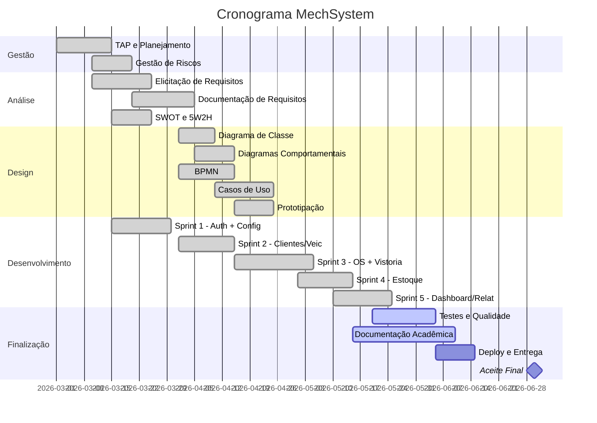

# TAP — Termo de Abertura do Projeto — MechSystem

**Projeto**: MechSystem — Sistema de Gestão para Oficinas Mecânicas  
**Versão**: 1.0  
**Data**: Maio/2026  
**Autor**: Ryan Cristian  
**Disciplina**: Engenharia de Software III — Prof. Alessandro Fukuta

---

## 1. Informações Gerais

| Campo | Informação |
|-------|-----------|
| **Nome do Projeto** | MechSystem |
| **Gerente do Projeto** | Ryan Cristian |
| **Sponsor** | Prof. Alessandro Fukuta (acadêmico) / Proprietário de oficina (comercial) |
| **Data de Início** | 01/03/2026 |
| **Data Prevista de Término** | 30/06/2026 |
| **Orçamento Estimado** | R$ 42.500,00 |
| **Prioridade** | Alta |

---

## 2. Justificativa do Projeto

O setor de oficinas mecânicas no Brasil é composto por mais de **130 mil estabelecimentos**, sendo a grande maioria **micro e pequenas empresas** que operam com processos manuais (fichas em papel, planilhas, cadernos). Essa realidade gera:

- **Perda de informações** de clientes e histórico de serviços
- **Descontrole financeiro** — falta de visibilidade sobre receitas, custos e margens
- **Rupturas de estoque** — peças faltam no momento crítico
- **Problemas jurídicos** — falta de documentação de vistorias e orçamentos (CDC)
- **Baixa produtividade** — retrabalho e comunicação ineficiente

O **MechSystem** foi concebido para resolver esses problemas com uma solução **acessível, moderna e integrada**, eliminando a barreira tecnológica que impede essas empresas de se digitalizarem.

---

## 3. Objetivos do Projeto

### 3.1 Objetivo Geral

Desenvolver e entregar uma **aplicação web completa** para gestão de oficinas mecânicas, cobrindo todo o fluxo operacional desde o atendimento até a entrega do veículo.

### 3.2 Objetivos Específicos

| # | Objetivo | Métrica de Sucesso |
|---|---------|-------------------|
| OE1 | Implementar sistema de autenticação seguro com perfis de acesso | 3 perfis (Admin, Atendimento, Mecânico) operacionais |
| OE2 | Criar módulo de CRUD completo para Clientes, Veículos e Serviços | 100% dos campos implementados e validados |
| OE3 | Desenvolver gestão de OS com ciclo de vida completo (5 estados) | Máquina de estados funcional |
| OE4 | Implementar controle de estoque com movimentação automática | Baixa automática ao vincular peça à OS |
| OE5 | Criar dashboard com indicadores de BI | Mínimo 5 KPIs operacionais |
| OE6 | Garantir portabilidade (Windows/Linux/macOS, SQLite/PostgreSQL) | Deploy bem-sucedido em 2+ plataformas |
| OE7 | Documentar o projeto com todos os artefatos de ES3 | 19 artefatos entregues |

---

## 4. Escopo do Projeto

### 4.1 Escopo Incluído (In Scope)

- ✅ Autenticação e autorização com Cookie + BCrypt
- ✅ CRUD de Clientes, Veículos, Serviços, Peças e Usuários
- ✅ Gestão de Ordens de Serviço (criação, acompanhamento, conclusão)
- ✅ Vistoria de entrada obrigatória (checklist + avarias)
- ✅ Controle de estoque com movimentações rastreadas
- ✅ Dashboard com BI (receitas, ticket médio, funil)
- ✅ Relatórios (Financeiro, OS, Estoque)
- ✅ Configurações dinâmicas da oficina
- ✅ Token de acompanhamento para clientes
- ✅ Interface responsiva (desktop + mobile via CSS nativo)
- ✅ Impressão formatada de OS

### 4.2 Escopo Excluído (Out of Scope)

- ❌ Emissão de NF-e / NFS-e
- ❌ Integração com gateways de pagamento
- ❌ App mobile nativo (iOS/Android)
- ❌ Integração com DETRAN / seguradoras
- ❌ Chat em tempo real com cliente
- ❌ Módulo de agendamento online
- ❌ Integração com marketplace de peças

---

## 5. Stakeholders

| Stakeholder | Papel | Interesse | Influência |
|------------|-------|----------|-----------|
| Ryan Cristian | Gerente de Projeto / Desenvolvedor | Entrega do projeto completo | Alta |
| Prof. Alessandro Fukuta | Orientador Acadêmico | Qualidade dos artefatos de ES3 | Alta |
| Proprietário de Oficina | Cliente / Sponsor | Sistema funcional e acessível | Alta |
| Atendente | Usuário Primário | Facilidade de uso, rapidez | Média |
| Mecânico | Usuário Operacional | Consulta rápida de OS | Baixa |
| Cliente da Oficina | Beneficiário Indireto | Transparência e acompanhamento | Baixa |

---

## 6. Premissas

| # | Premissa |
|---|---------|
| P1 | O desenvolvedor terá dedicação mínima de 20h semanais ao projeto |
| P2 | O ambiente de desenvolvimento (Windows + .NET 10 SDK) estará disponível durante todo o projeto |
| P3 | O stakeholder (proprietário da oficina) estará disponível para validações quinzenais |
| P4 | O banco de dados SQLite é suficiente para a versão 1.0 (até 10.000 registros) |
| P5 | A aplicação será acessada inicialmente na rede local da oficina |
| P6 | Os requisitos não sofrerão mudanças significativas após a Sprint 2 |

---

## 7. Restrições

| # | Restrição |
|---|----------|
| R1 | **Prazo**: Entrega até 30/06/2026 (deadline acadêmico) |
| R2 | **Equipe**: Apenas 1 desenvolvedor full-stack |
| R3 | **Orçamento**: Sem custo real de infraestrutura (uso de ferramentas gratuitas e SQLite local) |
| R4 | **Tecnologia**: Stack obrigatoriamente .NET 10 + Blazor Server (decisão de arquitetura já tomada) |
| R5 | **Segurança**: Senhas DEVEM ser criptografadas (não armazenar em texto plano) |
| R6 | **Compliance**: OS deve ter previsão de entrega obrigatória (exigência CDC) |

---

## 8. Riscos Iniciais

| # | Risco | Probabilidade | Impacto | Mitigação |
|---|-------|--------------|---------|----------|
| RI01 | Escopo creep — stakeholder solicitar funcionalidades fora do escopo | Média | Alto | Escopo documentado e congelado após Sprint 2 |
| RI02 | Complexidade do módulo de OS maior que estimado | Alta | Médio | Buffer de 15% nas estimativas de horas |
| RI03 | Problemas de performance com Blazor Server em conexões instáveis | Baixa | Médio | Otimização de componentes e lazy loading |
| RI04 | Falta de tempo para completar todos os artefatos acadêmicos | Média | Alto | Priorização por peso (BPMN e UC primeiro) |
| RI05 | Perda de dados do banco SQLite (arquivo local) | Baixa | Alto | Backup periódico automatizado |

---

## 9. Cronograma Macro

---

## 10. Critérios de Aceite do Projeto

| # | Critério |
|---|---------|
| CA1 | Todos os 49 requisitos funcionais implementados e demonstráveis |
| CA2 | Sistema rodando em ambiente de produção (local ou nuvem) |
| CA3 | Todos os 19 artefatos de ES3 entregues e com qualidade |
| CA4 | Demonstração funcional completa para o professor e stakeholder |
| CA5 | Código versionado no GitHub com README atualizado |

---

## 11. Aprovações

| Nome | Papel | Data | Assinatura |
|------|-------|------|-----------|
| Ryan Cristian | Gerente de Projeto | ___/___/2026 | _______________ |
| Prof. Alessandro Fukuta | Sponsor Acadêmico | ___/___/2026 | _______________ |

---

*Documento elaborado como artefato da disciplina de Engenharia de Software III — FATEC 2026/1*
