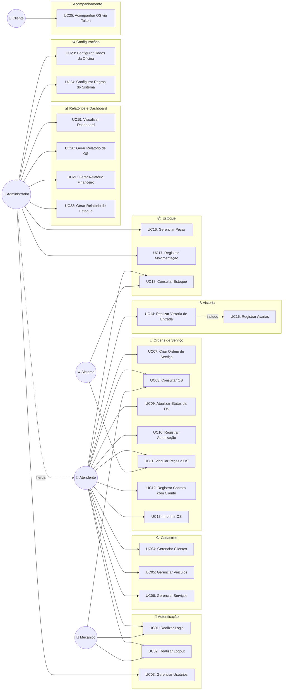
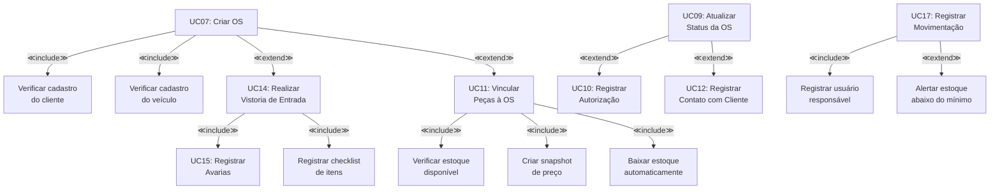

# Diagrama de Caso de Uso — MechSystem

**Projeto**: MechSystem — Sistema de Gestão para Oficinas Mecânicas  
**Versão**: 1.0  
**Data**: Maio/2026  
**Autor**: Ryan Cristian  
**Disciplina**: Engenharia de Software III — Prof. Alessandro Fukuta

---

## 1. Objetivo

Apresentar o **Diagrama de Caso de Uso** do sistema MechSystem, identificando os atores, seus casos de uso e os relacionamentos entre eles (inclusão, extensão e generalização).

---

## 2. Atores do Sistema

| Ator | Tipo | Descrição |
|------|------|----------|
| **Administrador** | Primário | Proprietário/gerente da oficina. Acesso total ao sistema. Herda todos os casos de uso dos demais perfis. |
| **Atendente** | Primário | Responsável pelo atendimento, cadastros, criação de OS e comunicação com cliente. |
| **Mecânico** | Primário | Responsável pela execução dos serviços e consulta de OS. Acesso restrito. |
| **Cliente** | Secundário (Externo) | Dono do veículo. Acessa o sistema apenas via token de acompanhamento. |
| **Sistema** | Interno | Automação de processos (cálculos, alertas, movimentações automáticas). |

---

## 3. Diagrama de Caso de Uso — Visão Geral

---

## 4. Diagrama de Relacionamentos (Include / Extend)

---

## 5. Lista Completa de Casos de Uso

| ID | Caso de Uso | Ator Primário | Módulo |
|----|------------|--------------|--------|
| UC01 | Realizar Login | Atendente, Mecânico, Administrador | Autenticação |
| UC02 | Realizar Logout | Atendente, Mecânico, Administrador | Autenticação |
| UC03 | Gerenciar Usuários | Administrador | Autenticação |
| UC04 | Gerenciar Clientes (CRUD) | Atendente | Cadastros |
| UC05 | Gerenciar Veículos (CRUD) | Atendente | Cadastros |
| UC06 | Gerenciar Serviços (CRUD) | Atendente | Cadastros |
| UC07 | Criar Ordem de Serviço | Atendente | OS |
| UC08 | Consultar Ordem de Serviço | Atendente, Mecânico | OS |
| UC09 | Atualizar Status da OS | Atendente | OS |
| UC10 | Registrar Autorização do Cliente | Atendente | OS |
| UC11 | Vincular Peças à OS | Atendente, Sistema | OS |
| UC12 | Registrar Contato com Cliente | Atendente | OS |
| UC13 | Imprimir OS | Atendente | OS |
| UC14 | Realizar Vistoria de Entrada | Atendente | Vistoria |
| UC15 | Registrar Avarias do Veículo | Atendente | Vistoria |
| UC16 | Gerenciar Peças (CRUD) | Administrador | Estoque |
| UC17 | Registrar Movimentação de Estoque | Administrador | Estoque |
| UC18 | Consultar Estoque | Atendente, Administrador | Estoque |
| UC19 | Visualizar Dashboard | Administrador | Relatórios |
| UC20 | Gerar Relatório de OS | Administrador | Relatórios |
| UC21 | Gerar Relatório Financeiro | Administrador | Relatórios |
| UC22 | Gerar Relatório de Estoque | Administrador | Relatórios |
| UC23 | Configurar Dados da Oficina | Administrador | Configurações |
| UC24 | Configurar Regras do Sistema | Administrador | Configurações |
| UC25 | Acompanhar OS via Token | Cliente | Acompanhamento |

---

## 6. Conclusão

O diagrama de caso de uso do MechSystem identifica **5 atores** e **25 casos de uso** distribuídos em **8 módulos funcionais**. O Administrador herda todas as permissões do Atendente, refletindo a hierarquia de perfis (RBAC) implementada no sistema. Os relacionamentos de `<<include>>` e `<<extend>>` demonstram a composição de funcionalidades complexas a partir de funcionalidades atômicas.

---

*Documento elaborado como artefato da disciplina de Engenharia de Software III — FATEC 2026/1*
