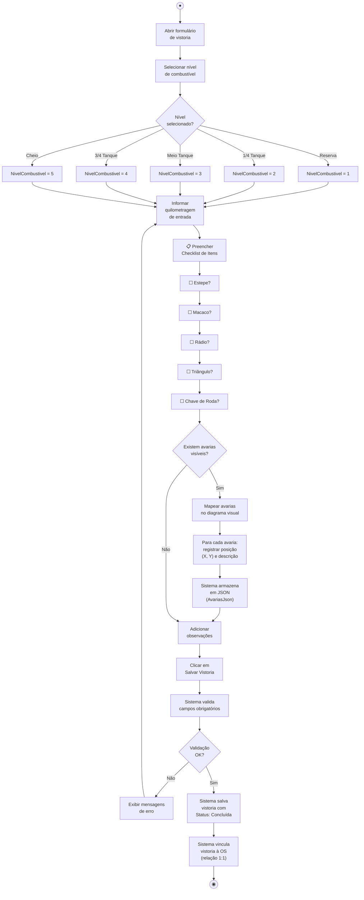
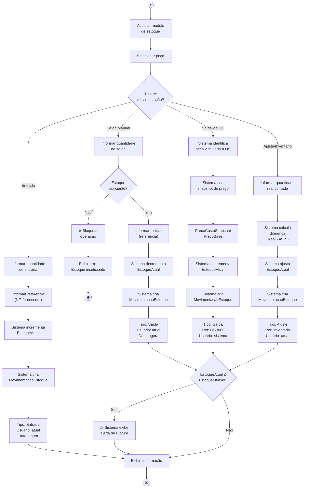

# Diagramas de Atividade — MechSystem

**Projeto**: MechSystem — Sistema de Gestão para Oficinas Mecânicas  
**Versão**: 1.0  
**Data**: Maio/2026  
**Autor**: Ryan Cristian  
**Disciplina**: Engenharia de Software III — Prof. Alessandro Fukuta

---

## 1. Objetivo

Apresentar **3 Diagramas de Atividade** representando os fluxos operacionais mais importantes do sistema MechSystem, detalhando as ações, decisões e partições de responsabilidade (swimlanes).

---

## 2. Diagrama de Atividade 1 — Fluxo de Criação de Ordem de Serviço

### Descrição
Modela o fluxo completo desde a chegada do cliente até a OS ser registrada no sistema com status "Orçamento".

```mermaid
flowchart TD
    START(("●")) --> A["Cliente chega<br/>à oficina"]
    A --> B{"Cliente já<br/>cadastrado?"}
    
    B -->|Não| C["Cadastrar<br/>novo cliente"]
    C --> D["Preencher:<br/>Nome, CPF,<br/>Telefone, Email"]
    D --> E{"Veículo já<br/>cadastrado?"}
    
    B -->|Sim| E
    
    E -->|Não| F["Cadastrar<br/>novo veículo"]
    F --> G["Preencher:<br/>Placa, Marca,<br/>Modelo, Ano, KM"]
    G --> H["Vincular veículo<br/>ao cliente"]
    H --> I["Coletar relato<br/>do problema"]
    
    E -->|Sim| I
    
    I --> J["Criar OS<br/>(Status: Orçamento)"]
    J --> K["Preencher:<br/>diagnóstico,<br/>previsão de entrega"]
    K --> L{"Vistoria<br/>obrigatória?"}
    
    L -->|Sim| M["Realizar vistoria<br/>de entrada"]
    M --> M1["Registrar:<br/>combustível, KM,<br/>checklist, avarias"]
    M1 --> N["Selecionar serviços<br/>do catálogo"]
    
    L -->|Não| N
    
    N --> O["Sistema calcula<br/>valor de mão de obra"]
    O --> P{"Adicionar<br/>peças?"}
    
    P -->|Sim| Q["Selecionar peças<br/>do estoque"]
    Q --> R["Informar<br/>quantidade"]
    R --> S["Sistema cria<br/>snapshot de preço"]
    S --> T["Sistema calcula<br/>valor total<br/>(MO + Peças)"]
    
    P -->|Não| T2["Sistema calcula<br/>valor total<br/>(apenas MO)"]
    
    T --> U["Salvar OS"]
    T2 --> U
    
    U --> V["Sistema gera<br/>token de<br/>acompanhamento"]
    V --> W["Sistema exibe<br/>confirmação"]
    W --> X{"Imprimir<br/>orçamento?"}
    
    X -->|Sim| Y["Sistema gera<br/>impressão<br/>formatada"]
    Y --> END(("◉"))
    X -->|Não| END
```

### Partições (Swimlanes)

| Ator | Atividades |
|------|-----------|
| **Atendente** | Cadastrar cliente/veículo, coletar relato, criar OS, selecionar serviços/peças, realizar vistoria |
| **Sistema** | Calcular valores, criar snapshot, gerar token, gerar impressão |

---

## 3. Diagrama de Atividade 2 — Fluxo de Vistoria de Entrada

### Descrição
Detalha o processo de inspeção do veículo na entrada da oficina, incluindo checklist de itens, nível de combustível e mapeamento de avarias.

### Dados Registrados

| Campo | Tipo | Obrigatório |
|-------|------|------------|
| Nível de Combustível | Enum (1-5) | ✅ Sim |
| Quilometragem de Entrada | int | ✅ Sim |
| Estepe | bool | Não |
| Macaco | bool | Não |
| Rádio | bool | Não |
| Triângulo | bool | Não |
| Chave de Roda | bool | Não |
| Avarias | JSON [{X, Y, Desc}] | Não |
| Observações | string | Não |

---

## 4. Diagrama de Atividade 3 — Fluxo de Movimentação de Estoque

### Descrição
Modela os três tipos de movimentação de estoque (Entrada, Saída e Ajuste) e seus efeitos no saldo de peças.

### Regras de Negócio Aplicadas

| Regra | Descrição | Diagrama |
|-------|----------|---------|
| RN09 | Toda movimentação registra tipo, quantidade, data, referência e usuário | Todos os fluxos |
| RN10 | Snapshot de preço é criado na saída via OS | Fluxo "Saída via OS" |
| RN12 | Alerta quando EstoqueAtual ≤ EstoqueMinimo | Decisão CHECK |
| RN18 | UsuarioId é obrigatório em toda movimentação | Campo "Usuário: atual" |

---

## 5. Conclusão

Os 3 diagramas de atividade cobrem os fluxos mais críticos do MechSystem:
1. **Criação de OS** — o processo core do negócio
2. **Vistoria de Entrada** — proteção jurídica e documentação
3. **Movimentação de Estoque** — controle de inventário

Cada diagrama está alinhado com os requisitos funcionais e regras de negócio documentados.

---

*Documento elaborado como artefato da disciplina de Engenharia de Software III — FATEC 2026/1*
