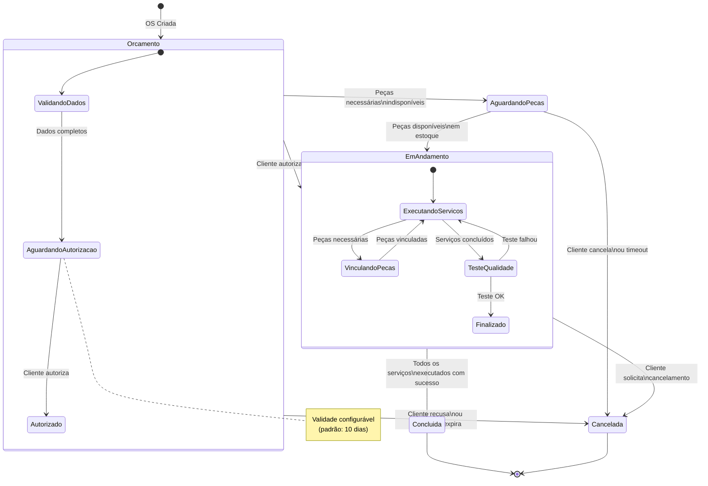
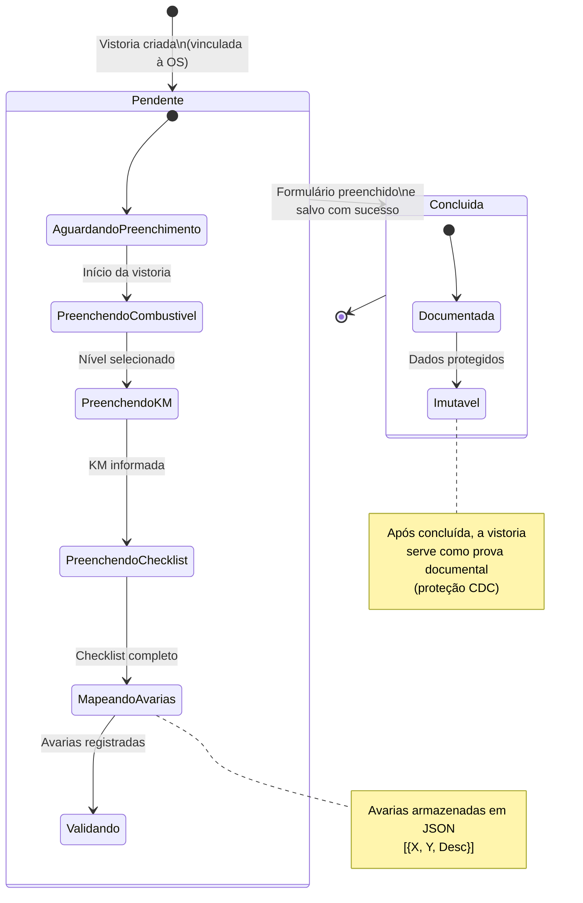
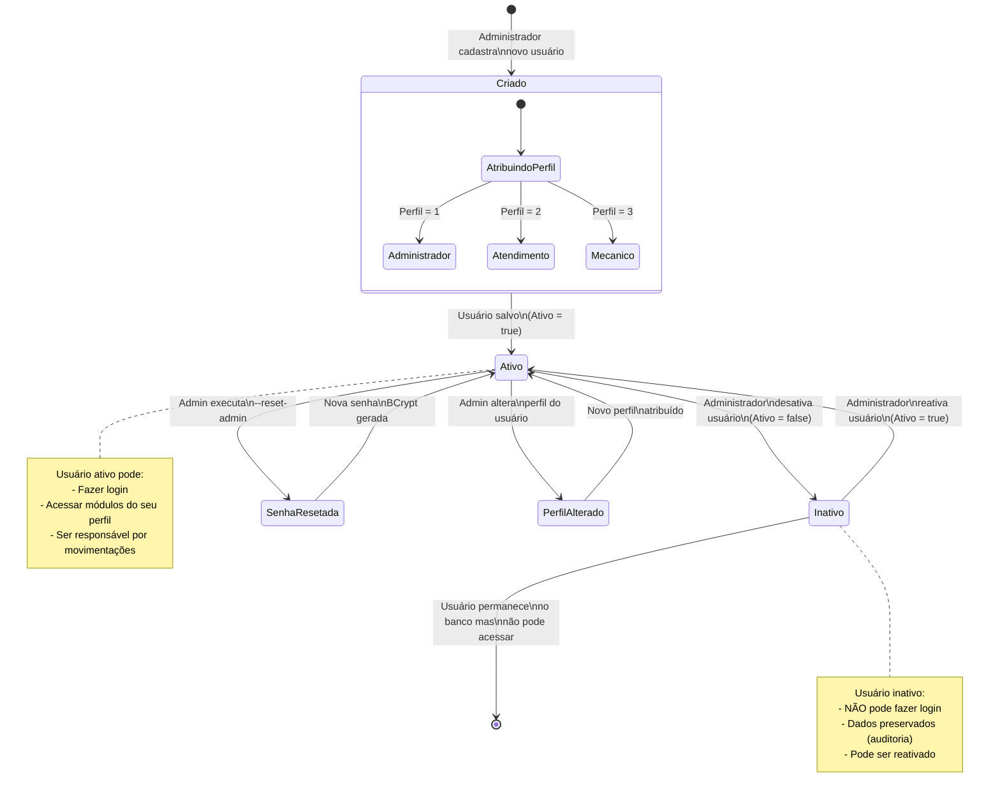

# Diagramas de Máquina de Estado — MechSystem

**Projeto**: MechSystem — Sistema de Gestão para Oficinas Mecânicas  
**Versão**: 1.0  
**Data**: Maio/2026  
**Autor**: Ryan Cristian  
**Disciplina**: Engenharia de Software III — Prof. Alessandro Fukuta

---

## 1. Objetivo

Apresentar **3 Diagramas de Máquina de Estado** que modelam as transições de estados das entidades mais importantes do MechSystem, mapeados diretamente dos Enums implementados no código-fonte.

---

## 2. Diagrama de Máquina de Estado 1 — Ordem de Serviço

### Descrição
Modela os 5 estados da Ordem de Serviço conforme o enum `OrdemServicoStatus` e as transições possíveis entre eles.

### Referência no Código
- Enum: [OrdemServicoStatus.cs](file:///c:/projeto/mechsystem/Models/OrdemServicoStatus.cs)
- Valores: `Orcamento(0)`, `AguardandoPecas(1)`, `EmAndamento(2)`, `Concluida(3)`, `Cancelada(4)`

### Diagrama

### Tabela de Transições

| Estado Atual | Evento / Gatilho | Estado Destino | Condição |
|-------------|------------------|----------------|---------|
| — | OS Criada | Orçamento | Veículo selecionado, diagnóstico preenchido |
| Orçamento | Peças indisponíveis | Aguardando Peças | Peças vinculadas sem estoque |
| Orçamento | Cliente autoriza | Em Andamento | Autorização registrada (UC10) |
| Orçamento | Cliente recusa / expira | Cancelada | Orçamento expirou ou recusado |
| Aguardando Peças | Peças chegam | Em Andamento | Estoque atualizado |
| Aguardando Peças | Cliente cancela | Cancelada | Solicitação do cliente |
| Em Andamento | Serviços concluídos | Concluída | Todos executados + teste OK |
| Em Andamento | Cliente cancela | Cancelada | Solicitação do cliente |

---

## 3. Diagrama de Máquina de Estado 2 — Vistoria

### Descrição
Modela os 2 estados da Vistoria conforme o enum `VistoriaStatus`.

### Referência no Código
- Enum: [VistoriaStatus](file:///c:/projeto/mechsystem/Models/Vistoria.cs) (linhas 60-67)
- Valores: `Pendente(0)`, `Concluida(1)`

### Diagrama

### Tabela de Transições

| Estado Atual | Evento / Gatilho | Estado Destino | Condição |
|-------------|------------------|----------------|---------|
| — | OS criada + vistoria obrigatória | Pendente | Configuração `ObrigarVistoriaParaOS = true` |
| Pendente | Formulário preenchido e salvo | Concluída | Campos obrigatórios validados (combustível + KM) |

### Campos Obrigatórios para Transição Pendente → Concluída

| Campo | Tipo | Validação |
|-------|------|----------|
| NivelCombustivel | Enum (1-5) | `[Required]` |
| QuilometragemEntrada | int | `[Required]` |

---

## 4. Diagrama de Máquina de Estado 3 — Usuário

### Descrição
Modela os estados do ciclo de vida de um Usuário no sistema, incluindo criação, ativação/desativação e perfis.

### Referência no Código
- Modelo: [Usuario.cs](file:///c:/projeto/mechsystem/Models/Usuario.cs)
- Enum de Perfis: [PerfilUsuario.cs](file:///c:/projeto/mechsystem/Models/Enums/PerfilUsuario.cs)
- Campo: `Ativo` (bool), `Perfil` (enum)

### Diagrama

### Tabela de Transições

| Estado Atual | Evento / Gatilho | Estado Destino | Condição |
|-------------|------------------|----------------|---------|
| — | Cadastro de usuário | Criado | Admin preenche Username, Senha, NomeCompleto, Perfil |
| Criado | Salvar no banco | Ativo | Validações passam, `Ativo = true` |
| Ativo | Desativar | Inativo | Admin altera `Ativo = false` |
| Inativo | Reativar | Ativo | Admin altera `Ativo = true` |
| Ativo | Reset de senha | Senha Resetada → Ativo | `--reset-admin` ou admin redefine |
| Ativo | Alterar perfil | Perfil Alterado → Ativo | Admin atribui novo `PerfilUsuario` |

### Perfis e Permissões

| Perfil | Código | Acesso |
|--------|--------|--------|
| Administrador | 1 | Tudo: cadastros, OS, estoque, relatórios, configurações, usuários |
| Atendimento | 2 | Cadastros, OS, consulta de estoque. Sem: configurações, relatórios financeiros, desconto abaixo do preço base |
| Mecânico | 3 | Consulta de OS atribuídas. Sem: cadastros, estoque, configurações |

---

## 5. Conclusão

Os 3 diagramas de máquina de estado cobrem as entidades com ciclo de vida mais relevante no MechSystem:

1. **Ordem de Serviço** — 5 estados com transições complexas e subestados
2. **Vistoria** — 2 estados simples com foco em documentação
3. **Usuário** — Estados de ativação com controle de perfis (RBAC)

Todos os estados e transições são rastreáveis aos Enums e Models implementados no código-fonte.

---

*Documento elaborado como artefato da disciplina de Engenharia de Software III — FATEC 2026/1*
