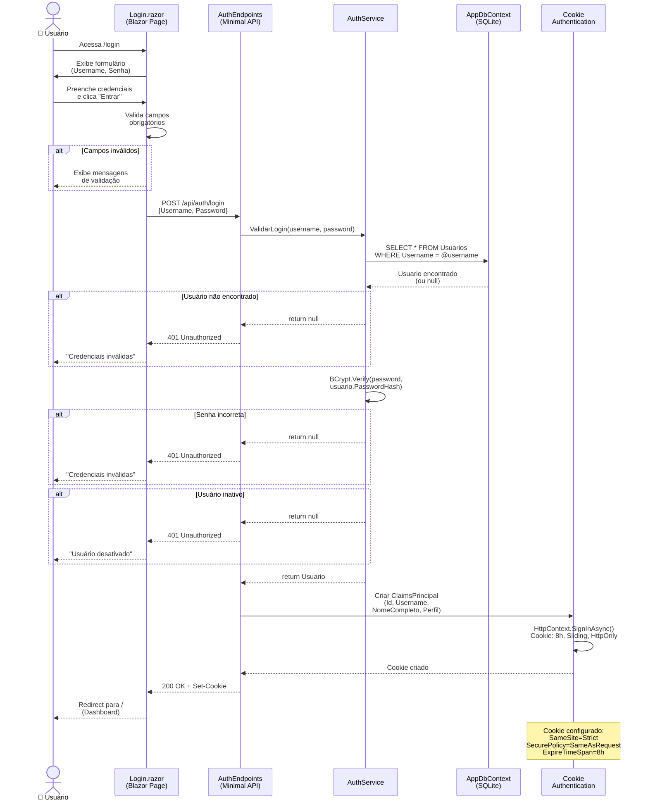
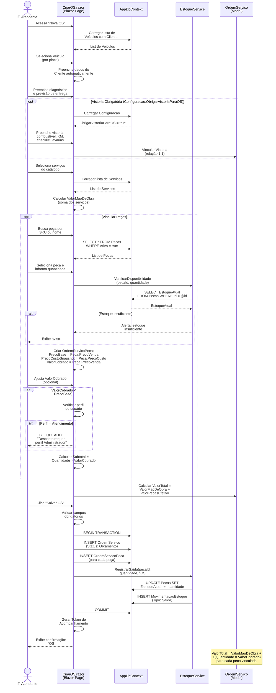
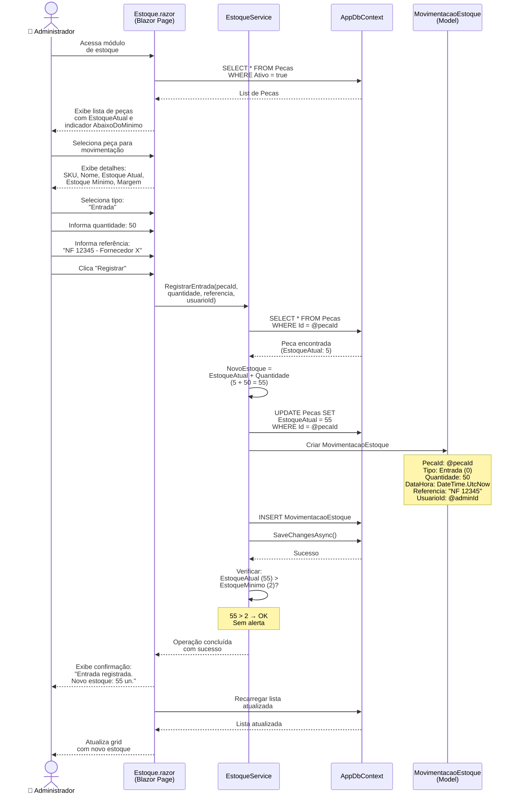
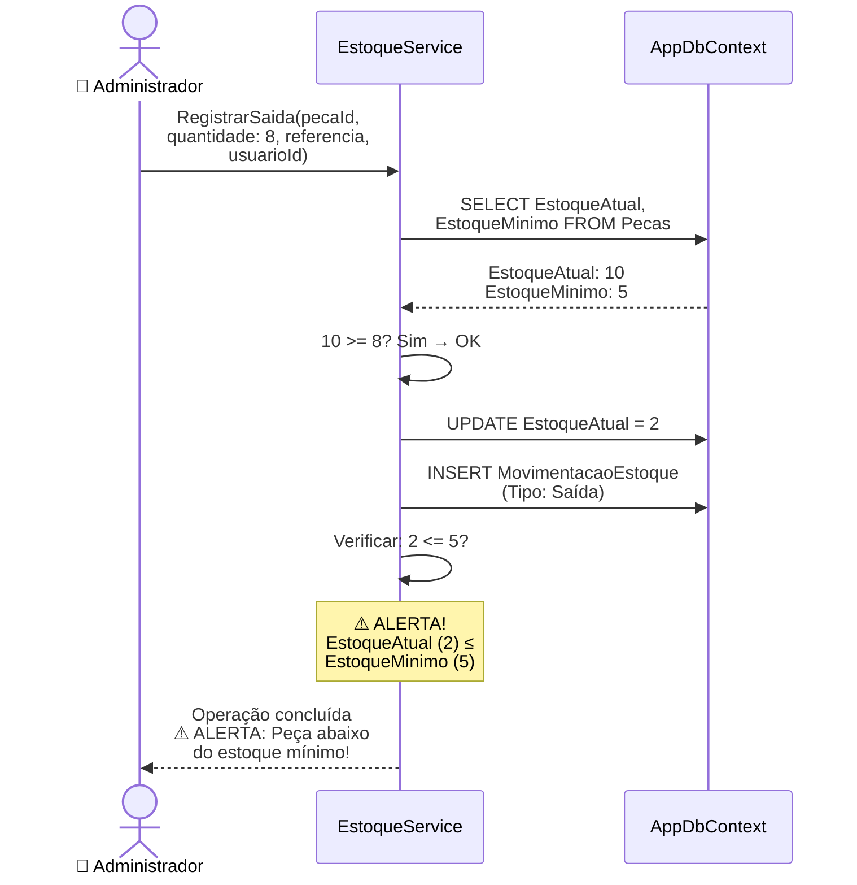

# Diagramas de Sequência — MechSystem

**Projeto**: MechSystem — Sistema de Gestão para Oficinas Mecânicas  
**Versão**: 1.0  
**Data**: Maio/2026  
**Autor**: Ryan Cristian  
**Disciplina**: Engenharia de Software III — Prof. Alessandro Fukuta

---

## 1. Objetivo

Apresentar **3 Diagramas de Sequência** que modelam a interação entre objetos (atores, componentes, serviços e banco de dados) nos cenários mais importantes do MechSystem.

---

## 2. Diagrama de Sequência 1 — Processo de Login / Autenticação

### Descrição
Modela a interação entre o Usuário, a página de Login (Blazor), o AuthEndpoints (Minimal API), o AuthService e o Banco de Dados durante o processo de autenticação.

### Referência no Código
- [AuthEndpoints.cs](file:///c:/projeto/mechsystem/Endpoints/AuthEndpoints.cs)
- [AuthService.cs](file:///c:/projeto/mechsystem/Services/AuthService.cs)
- [Login.cs](file:///c:/projeto/mechsystem/Models/Login.cs)

### Diagrama

---

## 3. Diagrama de Sequência 2 — Criação de Ordem de Serviço com Vínculo de Peças

### Descrição
Modela a interação completa durante a criação de uma OS, incluindo a seleção de veículo, vistoria opcional, vínculo de peças e cálculo automático de valores.

### Referência no Código
- [OrdemServico.cs](file:///c:/projeto/mechsystem/Models/OrdemServico.cs)
- [OrdemServicoPeca.cs](file:///c:/projeto/mechsystem/Models/OrdemServicoPeca.cs)
- [EstoqueService.cs](file:///c:/projeto/mechsystem/Services/EstoqueService.cs)

### Diagrama

---

## 4. Diagrama de Sequência 3 — Movimentação de Estoque (Entrada)

### Descrição
Modela a interação durante o registro de uma entrada de peça no estoque, incluindo validações, atualização de saldo e criação de registro de auditoria.

### Referência no Código
- [EstoqueService.cs](file:///c:/projeto/mechsystem/Services/EstoqueService.cs)
- [MovimentacaoEstoque.cs](file:///c:/projeto/mechsystem/Models/MovimentacaoEstoque.cs)
- [Peca.cs](file:///c:/projeto/mechsystem/Models/Peca.cs)

### Diagrama

### Cenário Alternativo — Saída com Alerta

---

## 5. Objetos Participantes (Resumo)

| Objeto | Tipo | Responsabilidade |
|--------|------|-----------------|
| Login.razor / CriarOS.razor / Estoque.razor | Blazor Component (UI) | Interação com usuário, validação de formulário |
| AuthEndpoints | Minimal API | Processar POST de login/logout |
| AuthService | Service | Validar credenciais, verificar BCrypt |
| EstoqueService | Service | Lógica de movimentação de estoque |
| AppDbContext | EF Core Context | Acesso ao banco de dados SQLite |
| OrdemServico, Peca, MovimentacaoEstoque | Model/Entity | Entidades de domínio |
| Cookie Authentication | Middleware | Gerenciar sessão autenticada |

---

## 6. Conclusão

Os 3 diagramas de sequência demonstram a interação entre as camadas do sistema:
1. **Login** — UI → API → Service → DB → Cookie
2. **Criação de OS** — UI → DB → Service (Estoque) → DB (transacional)
3. **Movimentação de Estoque** — UI → Service → DB + Auditoria

Cada diagrama é rastreável ao código-fonte real do MechSystem.

---

*Documento elaborado como artefato da disciplina de Engenharia de Software III — FATEC 2026/1*
