# Diagrama de Classe — MechSystem

**Projeto**: MechSystem — Sistema de Gestão para Oficinas Mecânicas  
**Versão**: 1.0  
**Data**: Maio/2026  
**Autor**: Ryan Cristian  
**Disciplina**: Engenharia de Software III — Prof. Alessandro Fukuta

---

## 1. Objetivo

Apresentar o **Diagrama de Classe** completo do sistema MechSystem, mapeado diretamente do código-fonte (diretório `Models/`), incluindo todas as entidades, atributos, métodos, enums e seus relacionamentos.

---

## 2. Diagrama de Classe Completo

```mermaid
classDiagram
    direction TB

    class Cliente {
        +int Id
        +string Nome
        +string Cpf
        +string Email
        +string Telefone
        +string Endereco
        +ICollection~Veiculo~ Veiculos
    }

    class Veiculo {
        +int Id
        +string Placa
        +string Marca
        +string Modelo
        +string Cor
        +int Ano
        +int Quilometragem
        +int ClienteId
        +Cliente Cliente
    }

    class OrdemServico {
        +int Id
        +int VeiculoId
        +Veiculo Veiculo
        +DateTime DataEmissao
        +DateTime DataPrevisaoInicio
        +DateTime DataPrevisaoEntrega
        +decimal ValorMaoDeObra
        +decimal ValorMaoDeObraEfetivo
        +decimal ValorPecas
        +string DescricaoProblemaRelatado
        +string ServicoAExecutar
        +OrdemServicoStatus Status
        +string AutorizadoPor
        +string MeioAutorizacao
        +DateTime DataAutorizacao
        +string TokenAcompanhamento
        +Vistoria Vistoria
        +ICollection~OrdemServicoPeca~ PecasUtilizadas
        +ICollection~OrdemServicoServico~ ServicosAExecutarList
        +ICollection~ContatoOS~ Contatos
        +decimal ValorPecasEfetivo
        +decimal ValorDesconto
        +decimal ValorTotal
        +int TempoTotalEstimadoMinutos
        +DateTime GetValidadeOrcamento(int validadeDias)
    }

    class OrdemServicoPeca {
        +int Id
        +int OrdemServicoId
        +OrdemServico OrdemServico
        +int PecaId
        +Peca Peca
        +int Quantidade
        +decimal PrecoBase
        +decimal ValorCobrado
        +decimal PrecoCustoSnapshot
        +decimal Subtotal
        +bool TemDescontoAbaixoDoMinimo
    }

    class OrdemServicoServico {
        +int Id
        +int OrdemServicoId
        +OrdemServico OrdemServico
        +int ServicoId
        +Servico Servico
        +int Quantidade
        +decimal PrecoBase
        +decimal ValorCobrado
        +int TempoEstimadoMinutosSnapshot
        +decimal Subtotal
        +int TempoTotalLinhaMinutos
    }

    class Vistoria {
        +int Id
        +int OrdemServicoId
        +OrdemServico OrdemServico
        +VistoriaStatus Status
        +NivelCombustivel NivelCombustivel
        +int QuilometragemEntrada
        +bool TemEstepe
        +bool TemMacaco
        +bool TemRadio
        +bool TemTriangulo
        +bool TemChaveRoda
        +string AvariasJson
        +string Observacoes
        +DateTime DataVistoria
    }

    class ContatoOS {
        +int Id
        +int OrdemServicoId
        +OrdemServico OrdemServico
        +DateTime DataContato
        +TipoContato Tipo
        +string Descricao
        +string RegistradoPor
    }

    class Peca {
        +int Id
        +string Sku
        +string Nome
        +string Marca
        +decimal PrecoCusto
        +decimal PrecoVenda
        +int EstoqueAtual
        +int EstoqueMinimo
        +string Localizacao
        +bool Ativo
        +ICollection~MovimentacaoEstoque~ Movimentacoes
        +bool AbaixoDoMinimo
        +decimal MargemLucro
    }

    class MovimentacaoEstoque {
        +int Id
        +int PecaId
        +Peca Peca
        +TipoMovimentacao Tipo
        +int Quantidade
        +DateTime DataHora
        +string Referencia
        +int UsuarioId
        +Usuario Usuario
    }

    class Servico {
        +int Id
        +string Nome
        +string Descricao
        +decimal ValorPadrao
        +int TempoEstimadoMinutos
    }

    class Usuario {
        +int Id
        +string Username
        +string PasswordHash
        +string NomeCompleto
        +bool Ativo
        +PerfilUsuario Perfil
        +DateTime DataCriacao
    }

    class Configuracao {
        +int Id
        +string NomeFantasia
        +string Cnpj
        +string Telefone
        +string WhatsApp
        +string Email
        +string EnderecoCompleto
        +string MensagemRodape
        +int ValidadeOrcamentoDias
        +int GarantiaPadraoDias
        +bool ObrigarVistoriaParaOS
        +string SimboloMoeda
        +decimal TaxaMaoDeObra
    }

    class Login {
        +string Username
        +string Password
    }

    class Relatorio {
        <<abstract>>
        +string Titulo
        +DateTime DataGeracao
        +string GeradoPor
        +string GerarResumo()*
        +string GetIcone()*
        +string GetCorTema()*
        +string GetCabecalho()
        +string GetDataFormatada()
    }

    class RelatorioOS {
        +int TotalOS
        +int TotalConcluidas
        +int TotalCanceladas
        +int TotalEmAndamento
        +int TotalOrcamentos
        +decimal FaturamentoTotal
        +decimal TicketMedio
        +double TaxaConversao
        +string GerarResumo()
        +string GetIcone()
        +string GetCorTema()
    }

    class RelatorioFinanceiro {
        +decimal ReceitaMaoDeObra
        +decimal ReceitaPecas
        +decimal ReceitaTotal
        +decimal LucroRealPecas
        +decimal CapitalImobilizado
        +int TotalOSPagas
        +double PercentualMaoDeObra
        +double PercentualPecas
        +string GerarResumo()
        +string GetIcone()
        +string GetCorTema()
    }

    class RelatorioEstoque {
        +int TotalPecasCadastradas
        +int PecasAtivas
        +int PecasAbaixoDoMinimo
        +decimal CapitalImobilizado
        +decimal MargemLucroMedia
        +int TotalMovimentacoes
        +string GerarResumo()
        +string GetIcone()
        +string GetCorTema()
    }

    class OrdemServicoStatus {
        <<enumeration>>
        Orcamento = 0
        AguardandoPecas = 1
        EmAndamento = 2
        Concluida = 3
        Cancelada = 4
    }

    class VistoriaStatus {
        <<enumeration>>
        Pendente = 0
        Concluida = 1
    }

    class NivelCombustivel {
        <<enumeration>>
        Reserva = 1
        UmQuarto = 2
        Meio = 3
        TresQuartos = 4
        Cheio = 5
    }

    class PerfilUsuario {
        <<enumeration>>
        Administrador = 1
        Atendimento = 2
        Mecanico = 3
    }

    class TipoMovimentacao {
        <<enumeration>>
        Entrada = 0
        Saida = 1
        Ajuste = 2
    }

    class TipoContato {
        <<enumeration>>
        Ligacao
        WhatsApp
        Email
        Presencial
        Outro
    }

    %% === RELACIONAMENTOS ===

    Cliente "1" --> "*" Veiculo : possui
    Veiculo "1" --> "*" OrdemServico : recebe
    OrdemServico "1" --> "0..1" Vistoria : contém
    OrdemServico "1" --> "*" OrdemServicoPeca : utiliza
    OrdemServico "1" --> "*" OrdemServicoServico : possui
    OrdemServico "1" --> "*" ContatoOS : registra
    OrdemServicoPeca "*" --> "1" Peca : referencia
    OrdemServicoServico "*" --> "1" Servico : referencia
    Peca "1" --> "*" MovimentacaoEstoque : movimenta
    MovimentacaoEstoque "*" --> "1" Usuario : responsável

    OrdemServico --> OrdemServicoStatus : status
    Vistoria --> VistoriaStatus : status
    Vistoria --> NivelCombustivel : combustível
    Usuario --> PerfilUsuario : perfil
    MovimentacaoEstoque --> TipoMovimentacao : tipo
    ContatoOS --> TipoContato : tipo

    Relatorio <|-- RelatorioOS : herda
    Relatorio <|-- RelatorioFinanceiro : herda
    Relatorio <|-- RelatorioEstoque : herda
```

---

## 3. Detalhamento dos Relacionamentos

| Origem | Destino | Cardinalidade | Tipo | Descrição |
|--------|---------|--------------|------|----------|
| Cliente | Veiculo | 1 : N | Composição | Um cliente possui vários veículos |
| Veiculo | OrdemServico | 1 : N | Associação | Um veículo pode ter várias OS |
| OrdemServico | Vistoria | 1 : 0..1 | Composição | Uma OS pode ter no máximo uma vistoria |
| OrdemServico | OrdemServicoPeca | 1 : N | Composição | Uma OS pode utilizar várias peças |
| OrdemServico | OrdemServicoServico | 1 : N | Composição | Uma OS pode ter vários serviços a executar |
| OrdemServico | ContatoOS | 1 : N | Composição | Uma OS pode ter vários registros de contato |
| OrdemServicoPeca | Peca | N : 1 | Associação | Cada linha referencia uma peça do estoque |
| OrdemServicoServico | Servico | N : 1 | Associação | Cada linha referencia um serviço base |
| Peca | MovimentacaoEstoque | 1 : N | Composição | Uma peça tem histórico de movimentações |
| MovimentacaoEstoque | Usuario | N : 1 | Associação | Cada movimentação registra o responsável |
| Relatorio | RelatorioOS | Herança | Generalização | RelatorioOS herda de Relatorio (abstrata) |
| Relatorio | RelatorioFinanceiro | Herança | Generalização | RelatorioFinanceiro herda de Relatorio |
| Relatorio | RelatorioEstoque | Herança | Generalização | RelatorioEstoque herda de Relatorio |

---

## 4. Padrões de Design Identificados

### 4.1 Herança e Polimorfismo
A classe `Relatorio` é **abstrata** com 3 métodos abstratos (`GerarResumo()`, `GetIcone()`, `GetCorTema()`) que são sobrescritos (`override`) nas classes filhas. Isso demonstra **polimorfismo** — cada relatório gera seu próprio resumo com formatação específica.

### 4.2 Graceful Degradation
A propriedade `ValorPecasEfetivo` e `ValorMaoDeObraEfetivo` na `OrdemServico` implementam um padrão de **graceful degradation**: se existirem itens vinculados (peças/serviços), usa a soma calculada; senão, usa o valor manual como fallback.

### 4.3 Snapshot Pattern
A `OrdemServicoPeca` cria um **snapshot imutável** dos preços no momento da inserção (`PrecoBase`, `PrecoCustoSnapshot`), garantindo que o preço cobrado não mude retroativamente.

### 4.4 Computed Properties
Propriedades como `ValorTotal`, `Subtotal`, `AbaixoDoMinimo` e `MargemLucro` são calculadas em tempo de execução (marcadas `[NotMapped]`), seguindo o princípio de **single source of truth**.

---

## 5. Métricas do Diagrama

| Métrica | Valor |
|---------|-------|
| Total de Classes | 18 |
| Classes Concretas | 16 |
| Classes Abstratas | 1 (Relatorio) |
| Classes de DTO / ViewModel | 1 (Login) |
| Enumerações | 6 |
| Hierarquias de Herança | 1 (Relatorio → 3 subclasses) |
| Relacionamentos | 14 |
| Propriedades Calculadas | 8 |
| Total de Atributos | ~120 |

---

## 6. Conclusão

O Diagrama de Classe do MechSystem mapeia fielmente as **17 entidades** do diretório `Models/`, incluindo **6 enumerações**, **1 hierarquia de herança** e **12 relacionamentos**. O diagrama demonstra aplicação de conceitos de POO (herança, polimorfismo, encapsulamento) e padrões de design (Snapshot, Graceful Degradation, Computed Properties).

---

*Documento elaborado como artefato da disciplina de Engenharia de Software III — FATEC 2026/1*
