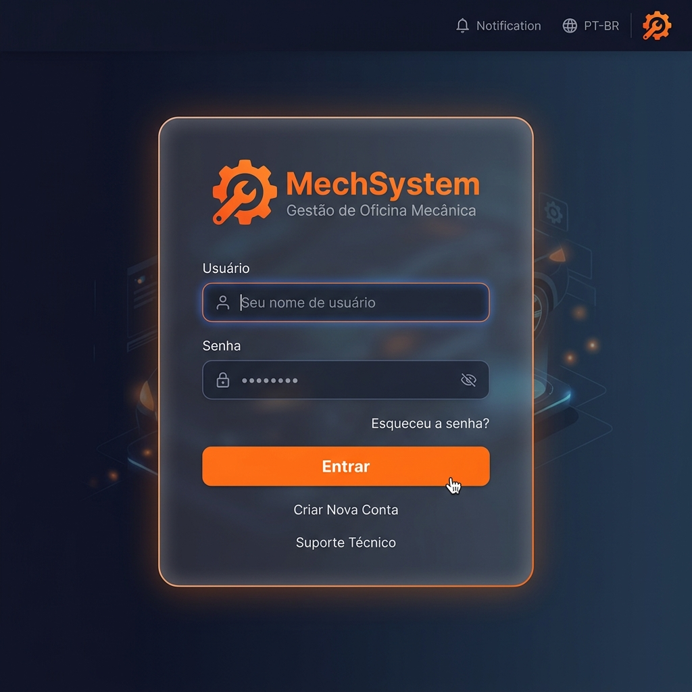
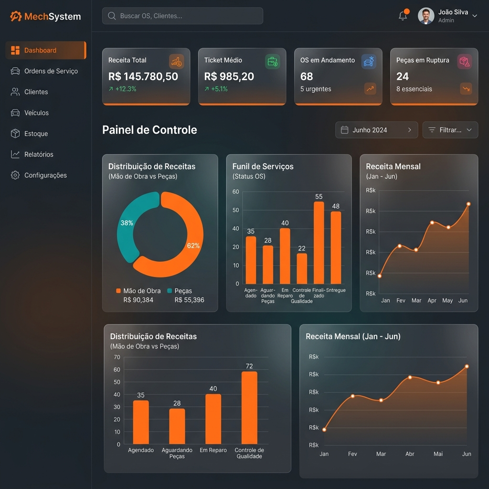
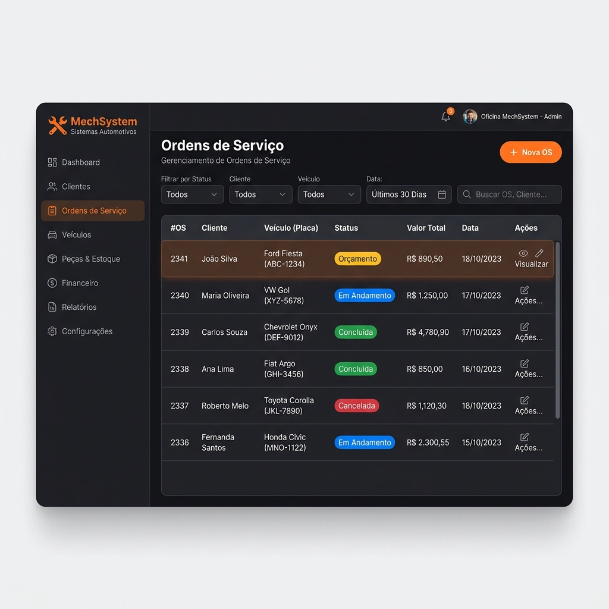
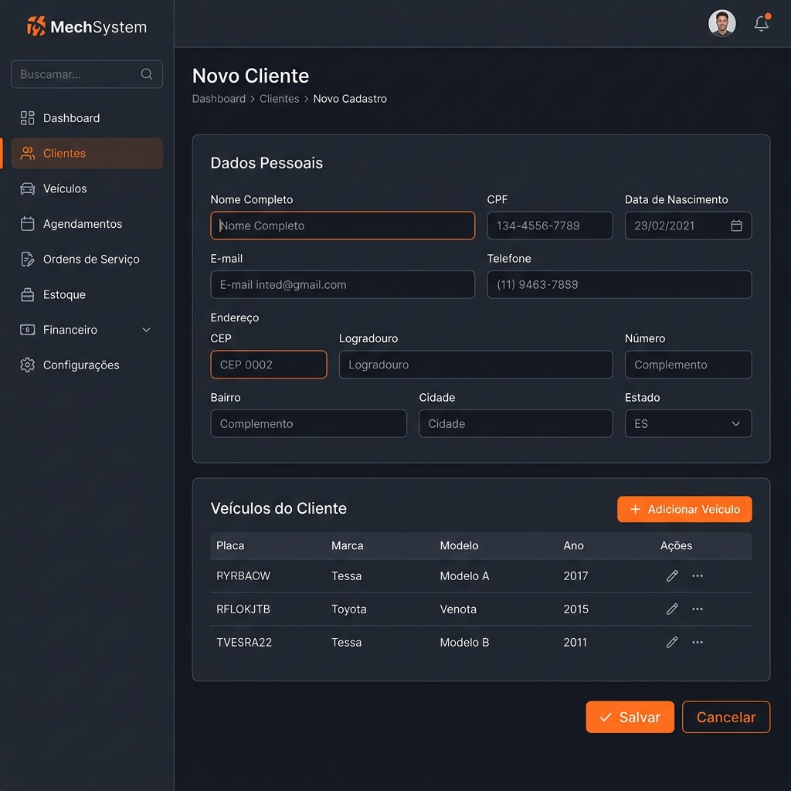
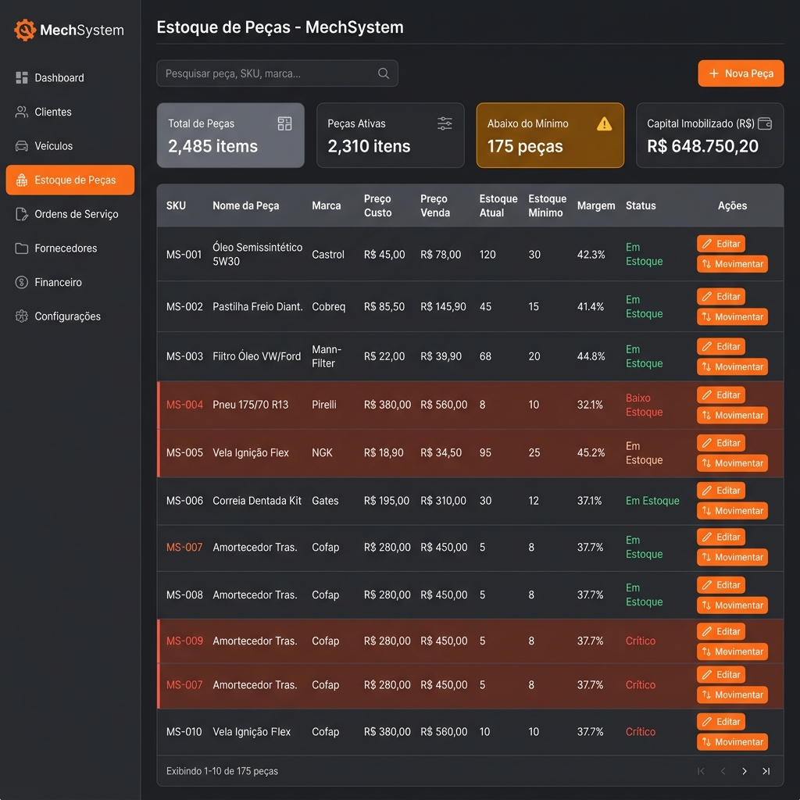
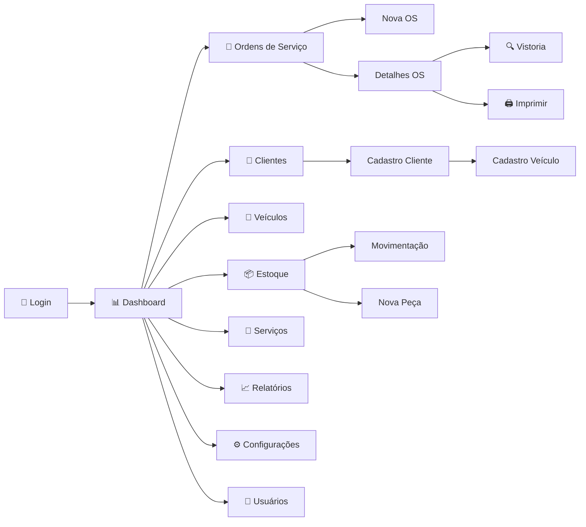

# Prototipação de Telas — MechSystem

**Projeto**: MechSystem — Sistema de Gestão para Oficinas Mecânicas  
**Versão**: 1.0  
**Data**: Maio/2026  
**Autor**: Ryan Cristian  
**Disciplina**: Engenharia de Software III — Prof. Alessandro Fukuta

---

## 1. Objetivo

Apresentar **5 protótipos de tela** do sistema MechSystem, representando as interfaces mais importantes da aplicação. Cada protótipo é acompanhado de descrição dos elementos, fluxo de interação e requisitos associados.

---

## 2. Protótipo 1 — Tela de Login

### Imagem

### Descrição dos Elementos

| Elemento | Tipo | Descrição |
|---------|------|----------|
| Logo MechSystem | Imagem/Ícone | Logo com ícone de engrenagem na cor primária (#ff751f) |
| Campo "Usuário" | Input text | Campo obrigatório para username |
| Campo "Senha" | Input password | Campo obrigatório com máscara |
| Botão "Entrar" | Button primary | Submete o formulário via POST para `/api/auth/login` |
| Card central | Container | Card com glassmorphism e borda sutil em laranja |
| Background | Gradient | Gradiente escuro (#1a1a2e → #16213e) |

### Fluxo de Interação

1. Usuário acessa a URL do sistema
2. Sistema exibe tela de login (única página pública)
3. Usuário preenche Username e Senha
4. Usuário clica em "Entrar"
5. Sistema valida credenciais (BCrypt)
6. Sucesso → Redirect para Dashboard | Falha → Mensagem de erro

### Requisitos Associados
- RF01, RF02, RF03, RF05, RNF03, RNF04

---

## 3. Protótipo 2 — Dashboard (Home)

### Imagem

### Descrição dos Elementos

| Elemento | Tipo | Descrição |
|---------|------|----------|
| Sidebar | Navegação | Menu lateral com links: Dashboard, OS, Clientes, Veículos, Estoque, Relatórios, Configurações |
| KPI Cards | Cards | 4 cards superiores: Receita Total, Ticket Médio, OS em Andamento, Peças em Ruptura |
| Gráfico de Receitas | Donut Chart | Distribuição percentual Mão de Obra vs. Peças |
| Funil de Serviços | Bar Chart | Quantidade de OS por status (Orçamento, Andamento, Concluída, Cancelada) |
| Gráfico de Tendência | Line Chart | Receita mensal ao longo do tempo |
| Header | Barra superior | Nome do usuário logado, botão de logout |

### Fluxo de Interação

1. Usuário autenticado é redirecionado para `/` (Dashboard)
2. Sistema calcula KPIs a partir das OS e peças do banco
3. Gráficos são renderizados com dados em tempo real
4. Sidebar permite navegar para outros módulos
5. Cards são clicáveis para drill-down nos dados

### Requisitos Associados
- RF41, RF42, RF43, RF44, RNF01, RNF08

---

## 4. Protótipo 3 — Gestão de Ordens de Serviço

### Imagem

### Descrição dos Elementos

| Elemento | Tipo | Descrição |
|---------|------|----------|
| Tabela de OS | Data Grid | Lista todas as OS com colunas: #, Cliente, Veículo, Status, Valor Total, Tempo Estimado, Data |
| Badges de Status | Pills coloridas | Orçamento (amarelo), Em Andamento (azul), Concluída (verde), Cancelada (vermelho) |
| Detalhes da OS (Itemização) | Formulário/Listas | Exibe informações gerais e duas seções detalhadas: "Serviços a Executar" (com tempo) e "Peças Utilizadas", além do campo de Desconto Global |
| Botão "Nova OS" | Button primary | Navega para formulário de criação de OS |
| Filtros | Dropdowns | Filtrar por status, período, cliente |
| Campo de Busca | Search input | Busca por número da OS, cliente ou placa |
| Ações por linha | Botões | Visualizar, Editar, Imprimir |

### Fluxo de Interação

1. Atendente acessa `/ordens-servico`
2. Sistema carrega e exibe todas as OS do banco
3. Atendente pode filtrar por status ou buscar por texto
4. Clique em "Nova OS" → formulário de criação
5. Clique em uma OS → detalhes com todas as informações
6. Badges coloridas indicam o estado atual de cada OS

### Requisitos Associados
- RF16, RF17, RF18, RF20, RF07, RF08

---

## 5. Protótipo 4 — Cadastro de Cliente

### Imagem

### Descrição dos Elementos

| Elemento | Tipo | Descrição |
|---------|------|----------|
| Seção "Dados Pessoais" | Formulário | Campos: Nome*, CPF*, E-mail, Telefone, Endereço |
| Seção "Veículos" | Tabela inline | Lista de veículos do cliente (Placa, Marca, Modelo, Ano) |
| Botão "Adicionar Veículo" | Button secondary | Abre formulário de cadastro de veículo vinculado |
| Botão "Salvar" | Button primary | Persiste os dados do cliente |
| Botão "Cancelar" | Button tertiary | Volta para a lista de clientes |
| Validações inline | Mensagens | Erros exibidos abaixo de cada campo |

### Fluxo de Interação

1. Atendente clica em "Novo Cliente" na listagem
2. Sistema exibe formulário em branco
3. Atendente preenche Nome (obrigatório) e CPF (obrigatório)
4. Opcionalmente preenche E-mail, Telefone, Endereço
5. Pode adicionar veículos inline
6. Clica em "Salvar" → validação → persistência
7. Retorna à listagem com mensagem de sucesso

### Requisitos Associados
- RF08, RF09, RF10, RF11, RF12, RN01

---

## 6. Protótipo 5 — Controle de Estoque

### Imagem

### Descrição dos Elementos

| Elemento | Tipo | Descrição |
|---------|------|----------|
| KPI Cards | Summary cards | Total de Peças, Peças Ativas, Abaixo do Mínimo (⚠), Capital Imobilizado (R$) |
| Tabela de Peças | Data Grid | SKU, Nome, Marca, Preço Custo/Venda, Estoque Atual/Mínimo, Margem, Status |
| Indicador de Ruptura | Highlight vermelho | Linhas com estoque abaixo do mínimo destacadas |
| Botão "Nova Peça" | Button primary | Formulário de cadastro de nova peça |
| Ações por linha | Botões | Editar, Movimentar (abre modal de movimentação) |
| Campo de Busca | Search input | Busca por SKU ou nome da peça |
| Coluna "Margem" | Percentual | Margem de lucro calculada automaticamente |

### Fluxo de Interação

1. Administrador acessa `/estoque`
2. Sistema exibe KPI cards com resumo do estoque
3. Tabela lista todas as peças com indicadores visuais
4. Peças com `EstoqueAtual ≤ EstoqueMinimo` são destacadas em vermelho/laranja
5. "Movimentar" abre modal para Entrada/Saída/Ajuste
6. "Nova Peça" abre formulário completo de cadastro

### Requisitos Associados
- RF37, RF38, RF39, RF40, RN10, RN11, RN12

---

## 7. Mapa de Navegação entre Telas

---

## 8. Padrões de Design Aplicados

| Padrão | Descrição | Telas |
|--------|----------|-------|
| **Dark Theme** | Tema escuro premium com contraste alto | Todas |
| **Glassmorphism** | Efeito de vidro fosco nos cards | Login, Dashboard |
| **Cor Primária #ff751f** | Laranja como accent color em botões e destaques | Todas |
| **Sidebar Navigation** | Menu lateral persistente com ícones | Dashboard, OS, Estoque, etc. |
| **Data Grid** | Tabelas de dados com filtros, busca e ações | OS, Estoque, Clientes |
| **KPI Cards** | Cards resumo com ícone, título e valor | Dashboard, Estoque |
| **Status Badges** | Pills coloridas para estados | OS, Estoque |
| **Inline Validation** | Mensagens de erro abaixo dos campos | Formulários |

---

## 9. Conclusão

Os 5 protótipos cobrem as telas mais importantes do MechSystem: Login, Dashboard, OS, Cadastro de Cliente e Estoque. O design segue uma identidade visual coesa (tema escuro, cor primária #ff751f) com padrões modernos de UI/UX aplicados consistentemente em todas as telas.

---

*Documento elaborado como artefato da disciplina de Engenharia de Software III — FATEC 2026/1*
