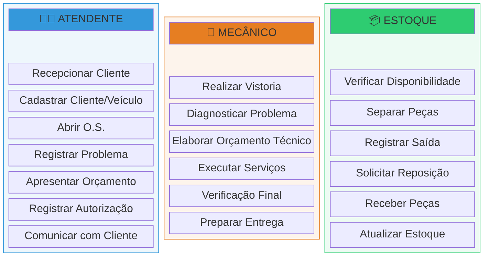

# Diagrama de Atividades — Ordem de Serviço (MechSystem)

## Visão Geral

Este diagrama representa o fluxo completo de uma **Ordem de Serviço (OS)** no sistema MechSystem,
desde a chegada do cliente até a entrega do veículo. Os status da OS seguem o enum `OrdemServicoStatus`:

| Código | Status             |
|--------|--------------------|
| 0      | Orçamento          |
| 1      | Aguardando Peças   |
| 2      | Em Andamento       |
| 3      | Concluída          |
| 4      | Cancelada          |

---

## Diagrama de Atividades

```mermaid
flowchart TD
    START(("●")) --> A["Cliente chega à oficina"]

    A --> B{"Cliente já\ncadastrado?"}
    B -- Não --> C["Cadastrar Cliente\n(Nome, CPF, Telefone, Email, Endereço)"]
    C --> D["Cadastrar Veículo\n(Placa, Marca, Modelo, Cor, Ano, KM)"]
    D --> E["Criar Ordem de Serviço"]
    B -- Sim --> B2{"Veículo já\ncadastrado?"}
    B2 -- Não --> D
    B2 -- Sim --> E

    E --> F["Status: ORÇAMENTO\n━━━━━━━━━━━━━━━━━━━\nRegistrar Problema Relatado\nDefinir Previsão de Entrega"]

    F --> G["Realizar Vistoria de Entrada\n━━━━━━━━━━━━━━━━━━━\n• Nível de Combustível\n• Quilometragem\n• Checklist (Estepe, Macaco,\n  Rádio, Triângulo, Chave de Roda)\n• Mapeamento de Avarias"]

    G --> H["Elaborar Orçamento\n━━━━━━━━━━━━━━━━━━━\n• Selecionar Serviços\n  (cálculo de tempo e valor)\n• Selecionar Peças do Estoque\n  (quantidade e preço unitário)\n• Aplicar Descontos"]

    H --> I["Apresentar Orçamento ao Cliente\n(Válido por N dias configurável)"]

    I --> J{"Cliente\nautoriza?"}

    J -- Não --> K["Status: CANCELADA"]
    K --> FIM1(("◉"))

    J -- Sim --> L["Registrar Autorização\n━━━━━━━━━━━━━━━━━━━\n• Autorizado por (nome/assinatura)\n• Meio (Presencial / WhatsApp / Telefone)\n• Data da Autorização"]

    L --> M{"Peças necessárias\ndisponíveis em estoque?"}

    M -- Não --> N["Status: AGUARDANDO PEÇAS\n━━━━━━━━━━━━━━━━━━━\nRegistrar contato com cliente\ninformando a situação"]
    N --> O["Receber Peças\n(Entrada no Estoque)"]
    O --> P["Vincular Peças à OS\n(OrdemServicoPeca)"]
    P --> Q["Status: EM ANDAMENTO"]

    M -- Sim --> P2["Vincular Peças à OS\n(OrdemServicoPeca)\nBaixa automática no estoque"]
    P2 --> Q

    Q --> R["Executar Serviços\n━━━━━━━━━━━━━━━━━━━\n• Mão de Obra\n• Instalação de Peças\n• Acompanhamento via Token"]

    R --> S{"Serviço\nconcluído?"}
    S -- Não --> T["Registrar Contato com Cliente\n(Atualização de status via\nWhatsApp / Telefone / Presencial)"]
    T --> R

    S -- Sim --> U["Verificação Final\n━━━━━━━━━━━━━━━━━━━\n• Calcular Valor Total\n  (Mão de Obra + Peças Efetivas)\n• Conferir Checklist de Entrega"]

    U --> V["Status: CONCLUÍDA"]

    V --> W["Gerar Documento de Entrega\n(Impressão da OS)"]

    W --> X["Entregar Veículo ao Cliente"]

    X --> FIM2(("◉"))

    style START fill:#000,stroke:#000,color:#fff
    style FIM1 fill:#000,stroke:#333,color:#fff
    style FIM2 fill:#000,stroke:#333,color:#fff
    style K fill:#e74c3c,stroke:#c0392b,color:#fff
    style F fill:#f39c12,stroke:#e67e22,color:#fff
    style N fill:#e67e22,stroke:#d35400,color:#fff
    style Q fill:#3498db,stroke:#2980b9,color:#fff
    style V fill:#2ecc71,stroke:#27ae60,color:#fff
```

---

## Raias de Responsabilidade (Swimlanes)

---

## Descrição das Atividades

### 1. Recepção e Cadastro
| Atividade | Descrição | Ator |
|-----------|-----------|------|
| Recepcionar Cliente | Cliente chega à oficina com demanda | Atendente |
| Verificar Cadastro | Consulta se cliente/veículo já existem no sistema | Atendente |
| Cadastrar Cliente | Registrar Nome, CPF, Telefone, Email, Endereço | Atendente |
| Cadastrar Veículo | Registrar Placa, Marca, Modelo, Cor, Ano, KM | Atendente |

### 2. Abertura da OS (Status: Orçamento)
| Atividade | Descrição | Ator |
|-----------|-----------|------|
| Criar OS | Gerar nova Ordem de Serviço vinculada ao veículo | Atendente |
| Registrar Problema | Preencher campo "Problema Relatado / Diagnóstico" | Atendente / Mecânico |
| Definir Prazos | Previsão de Início e Previsão de Entrega (obrigatória - CDC) | Atendente |

### 3. Vistoria de Entrada
| Atividade | Descrição | Ator |
|-----------|-----------|------|
| Registrar Combustível | Nível: Reserva, 1/4, Meio, 3/4 ou Cheio | Mecânico |
| Registrar KM | Quilometragem de entrada do veículo | Mecânico |
| Checklist | Estepe, Macaco, Rádio, Triângulo, Chave de Roda | Mecânico |
| Mapear Avarias | Marcação visual de danos pré-existentes (coordenadas X,Y + descrição) | Mecânico |

### 4. Orçamento e Autorização
| Atividade | Descrição | Ator |
|-----------|-----------|------|
| Calcular Orçamento | Vincular serviços (calcula tempo e mão de obra) + selecionar peças com preço + aplicar descontos | Mecânico |
| Apresentar ao Cliente | Enviar orçamento com validade configurável | Atendente |
| Registrar Autorização | Nome/assinatura, meio de autorização, data | Atendente |

### 5. Execução (Status: Em Andamento / Aguardando Peças)
| Atividade | Descrição | Ator |
|-----------|-----------|------|
| Verificar Estoque | Conferir se peças necessárias estão disponíveis | Estoque |
| Aguardar Peças | Se indisponível, OS fica em "Aguardando Peças" | Estoque |
| Vincular Peças | Associar peças à OS com quantidade e preço unitário | Mecânico / Estoque |
| Executar Serviços | Realizar manutenção/reparo no veículo | Mecânico |
| Comunicar Progresso | Registro de contatos com cliente (WhatsApp, Telefone, etc.) | Atendente |

### 6. Conclusão (Status: Concluída)
| Atividade | Descrição | Ator |
|-----------|-----------|------|
| Verificação Final | Conferir serviço, calcular valor total efetivo | Mecânico |
| Gerar Documento | Impressão da OS para entrega ao cliente | Atendente |
| Entregar Veículo | Devolução do veículo ao cliente | Atendente |

---

## Regras de Negócio Aplicadas

1. **Graceful Degradation**: Se houver itens vinculados (peças ou serviços), os valores manuais são ignorados e substituídos pela soma calculada (`ValorPecasEfetivo` e `ValorMaoDeObraEfetivo`).
2. **Valor Total e Tempo Estimado**: Valor calculado automaticamente como `(ValorMaoDeObraEfetivo + ValorPecasEfetivo) - ValorDesconto`. O Tempo Estimado é a soma do tempo base dos serviços listados.
3. **Validade do Orçamento**: Configurável via parâmetro `validadeDias`, calculada a partir da `DataEmissao`.
4. **Previsão de Entrega**: Campo obrigatório conforme CDC (Código de Defesa do Consumidor).
5. **Token de Acompanhamento**: Gerado para permitir o cliente acompanhar a OS externamente.
6. **Estoque Mínimo**: Alerta automático quando `EstoqueAtual <= EstoqueMinimo`.
